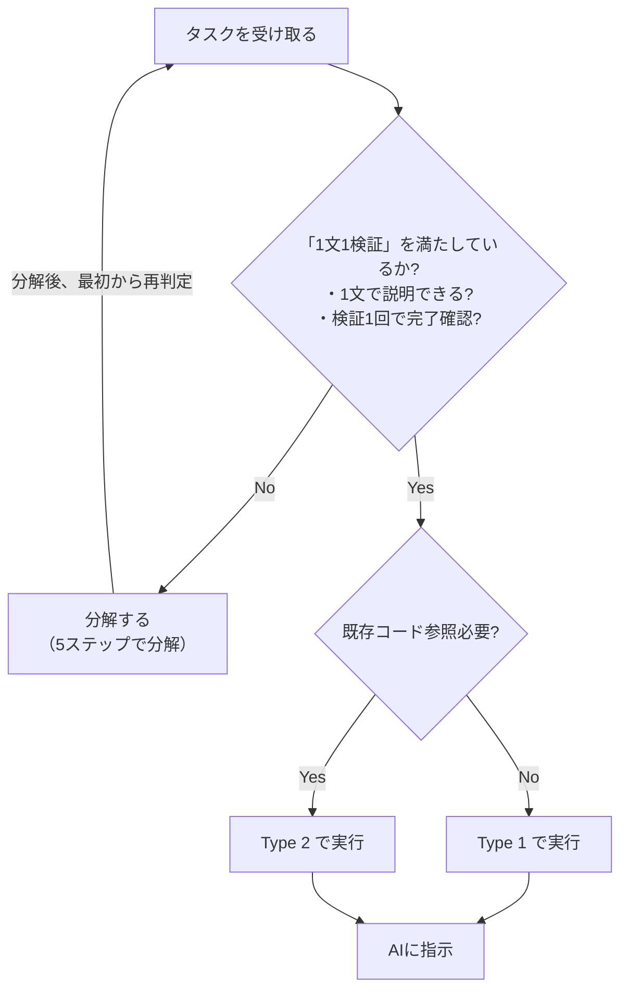

## 5. タスク分解とType分類 [L1/L2]

### 核心:タスク分解は人間の責務であり、AI協働の最重要スキル

タスク分解はAI協働開発において最も重要なスキルの1つ。
これは人間の責務であり、Claudeに委ねてはいけない。

```
┌─────────────────────────────────────────────────────────────────┐
│                    タスク分解の責務                              │
├─────────────────────────────────────────────────────────────────┤
│                                                                 │
│  タスク分解はAI協働開発において最も重要なスキルの1つ。           │
│  これは人間の責務であり、Claudeに委ねてはいけない。              │
│                                                                 │
│  ┌─────────────────────────────────────────────────────────┐   │
│  │  人間の責務                                              │   │
│  │  ─────────                                                │   │
│  │  ・大きな機能を小さなタスクに分解する                    │   │
│  │  ・各タスクの境界と完了条件を定義する                    │   │
│  │  ・タスクの依存関係と順序を決める                        │   │
│  │  ・1タスク = 1検証サイクルで回せる粒度にする             │   │
│  └─────────────────────────────────────────────────────────┘   │
│                              ↓                                  │
│  ┌─────────────────────────────────────────────────────────┐   │
│  │  Claudeの責務                                            │   │
│  │  ─────────────                                            │   │
│  │  ・分解されたタスクを実行する                            │   │
│  │  ・各タスクの検証結果を報告する                          │   │
│  │  ・不明点があれば質問する                                │   │
│  └─────────────────────────────────────────────────────────┘   │
│                                                                 │
│  なぜ人間がタスク分解をするのか?                               │
│  ─────────────────────────────                                  │
│  ・ビジネス価値や優先度を考慮できる                             │
│  ・検証可能な粒度を判断できる                                   │
│  ・チームの状況やリソースを考慮できる                           │
│  ・Claudeは「言われたことを実行する」のが得意                   │
└─────────────────────────────────────────────────────────────────┘
```

### Type分類:「1文1検証」を満たした後の実行方法 [L2]

Type分類は、**「1文1検証」を満たしたタスクの実行方法**を決めるものです。

> 💡 **重要**: Type分類の前に「1文1検証」を確認してください。
> 満たしていないタスクは、まず分解が必要です(→ タスク分解の5ステップ)。

#### Type分類の位置づけ

```
┌─────────────────────────────────────────────────────────────────┐
│                  タスクを受け取ったら                            │
├─────────────────────────────────────────────────────────────────┤
│                                                                 │
│  Step 1: 「1文1検証」を満たしているか?                         │
│  ─────────────────────────────────────                          │
│  ・1文で説明できるか?                                          │
│  ・検証1回で完了確認できるか?                                  │
│                                                                 │
│          ┌─────────────────────────────────────┐                │
│          │ 満たしていない → 分解が必要        │                │
│          │ (5ステップで分解してから戻る)    │                │
│          └─────────────────────────────────────┘                │
│                         │                                       │
│                         ↓ 満たしている                          │
│                                                                 │
│  Step 2: どう実行するか?(= Type分類)                         │
│  ──────────────────────────────────────                         │
│                                                                 │
│          ┌─────────────────────────────────────┐                │
│          │ 既存コード/パターン参照が必要?    │                │
│          │   No  → Type 1(直接指示でOK)     │                │
│          │   Yes → Type 2(コンテキストを添付)│                │
│          └─────────────────────────────────────┘                │
│                                                                 │
└─────────────────────────────────────────────────────────────────┘
```

#### Type定義

| Type | 条件 | 実行方法 | 例 |
|------|------|---------|-----|
| **Type 1** | 1文1検証を満たし、既存コード参照不要 | 直接指示 | 「Userエンティティを作成」 |
| **Type 2** | 1文1検証を満たし、既存コード参照必要 | コンテキストを添えて指示 | 「既存のauth.tsを参考にログインAPIを実装」 |

> 💡 **以前の「Type 3」について**: 「大規模・曖昧なタスク」は、Type分類の前提(1文1検証)を満たしていない状態です。
> まず5ステップで分解し、Type 1/2に分解できたらAIに渡します。

#### Type分類の判断基準

| 判断ポイント | Type 1 | Type 2 |
|-------------|--------|--------|
| 既存コード参照 | 不要 | 必要 |
| パターン準拠 | 一般的なベストプラクティス | プロジェクト固有のパターン |
| 必要情報 | 要件のみ | 要件 + コンテキスト(既存コード、エラーログ等) |

#### 実践例

```
❌ 分解が必要(1文1検証を満たしていない)
「認証機能を実装してください」
 → 「1文で説明できるか?」No(複数の成果物が含まれる)
 → まず5ステップで分解

✅ Type 1・2に分解して渡す
1. [Type 1] Userエンティティのボイラープレートを生成
2. [Type 2] 既存のauth.tsを参考にログインAPIを実装
3. [Type 2] エラーログを見てJWT検証の問題を修正
4. [Type 1] ログイン成功時のユニットテストを作成
```


### Type分類の境界ケース集 [L2]

Type 1/2の判断に迷いやすいケースをまとめました。

> 💡 **判断の基本原則**: 
> 1. まず「1文1検証」を満たしているか確認
> 2. 満たしていなければ分解(Type判定の前に)
> 3. 満たしていれば、既存コード参照の有無でType 1/2を判定

#### 境界ケース一覧

| ケース | 一見すると | 実際は | 理由 |
|--------|-----------|--------|------|
| 「エラーハンドリングを追加」 | Type 1(単純) | **Type 2** | 既存コードのパターンに合わせる必要がある |
| 「console.logを削除」 | Type 1(単純) | **Type 1** | 機械的な操作、コンテキスト不要 |
| 「テストを追加」 | Type 1(単純) | **Type 2** | 何をテストするか、既存パターンへの準拠が必要 |
| 「バグを修正」 | Type 2 | **要確認** | 範囲による。複数ファイルなら分解が必要 |
| 「パフォーマンス改善」 | Type 2 | **分解必要** | 調査→計測→実装→検証と複数判断が必要 |
| 「リファクタリング」 | Type 2 | **要確認** | 範囲による。1ファイルならType 2 |
| 「新しいAPIエンドポイント追加」 | Type 2 | **Type 2** | 既存パターンに従えばOK |
| 「新しいモジュール作成」 | 分解必要 | **分解必要** | 設計判断が必要、必ず分解する |
| 「既存機能に新フィールド追加」 | Type 1(単純) | **Type 2** | DB、API、UIの整合性確認が必要 |
| 「ログ出力の追加」 | Type 1(単純) | **Type 1 or 2** | 単純追加ならType 1、設計に関わるならType 2 |

#### 統合判断フロー



**ポイント**:
- 最初に「1文1検証」を確認
- 満たしていなければ分解(5ステップ)
- 満たしていればType 1/2を判定して実行
- 分解後は必ず最初から再判定

#### 判断に迷った時のルール

```
┌─────────────────────────────────────────────────────────────────┐
│  ルール1: 「適切に」「いい感じに」が含まれたら分解が必要       │
│                                                                 │
│  ルール2: 迷ったらType 2として扱う                             │
│  Type 1として扱って失敗するより、コンテキストを添えて安全に。  │
│                                                                 │
│  ルール3: 30分以上かかりそうなら分解を疑う                     │
│  「1文1検証」は通常15分以内で完了する粒度を想定。              │
└─────────────────────────────────────────────────────────────────┘
```

#### ケース別詳細解説

##### バリデーション追加

```
「入力のバリデーションを追加して」
└→ まず確認: 1文で説明できるか?
   ├→ 「適切に」が含まれた → Yes → 分解が必要(ルールを明確化してから)
   ├→ 既存バリデーションがある → Type 2(参照させる)
   └→ ない → Type 2(zodのパターンを指示する)

結論: 多くの場合 Type 2。ただしルールが曖昧なら分解が必要。
```

##### バグ修正

```
「画面が表示されないバグを直して」
└→ まず確認: 1文で説明できるか?
   ├→ 「見てみて」→ Yes → 分解が必要(何を改善するか明確化してから)
   ├→ デザインシステムがある → Type 2(参照させる)
   └→ ない → Type 2(参考UIを指示する)

結論: 指示が明確ならType 1/2、曖昧なら分解が必要。
```

##### UI改善

```
「UIを見やすくして」
└→ まず確認: 1文で説明できるか?
   ├→ 「見やすく」→ No(曖昧)→ 分解が必要
   └→ 「カラム幅を調整して」→ Yes → Type 2

結論: 具体的な変更点を特定してからType判定。
```


### タスク分解の5ステップ:「1文1検証」を満たすための手順 [L1]

「1文1検証」を満たしていないタスクを、満たす粒度まで分解する手順です。

> 💡 **このセクションを使うタイミング**: 
> タスクを受け取って「1文で説明できない」「検証1回で終わらない」と判断したとき。
> 分解後は統合判断フローの最初に戻り、Type 1/2を判定します。

```
┌─────────────────────────────────────────────────────────────────┐
│  タスク分解の5ステップ                                         │
│  ─────────────────────                                         │
│                                                                 │
│  Step 1: 最終成果物を特定する                                  │
│  「このタスクが完了したとき、何が存在しているか?」            │
│  例:ログイン機能 → エンティティ、API、テスト、ドキュメント   │
│                                                                 │
│  Step 2: 依存関係を整理する                                    │
│  「どの順番で作る必要があるか?」                              │
│  例:エンティティ → API → テスト → ドキュメント              │
│                                                                 │
│  Step 3: 各成果物を実装単位に分割する                          │
│  「各成果物をさらに小さく分けられるか?」                      │
│  例:API → ルート定義、ハンドラー、バリデーション             │
│                                                                 │
│  Step 4: 「1文1検証」単位に調整する ← 核心                    │
│  「typecheck/lint/test のいずれか1回で完了確認できるか?」     │
│  できなければさらに分割、できれば粒度OK                        │
│                                                                 │
│  Step 5: Type 1/2を判定してラベル付け                          │
│  各タスクにType 1/2を付与。分解が必要なものが残っていたら      │
│  再分解する。                                                   │
│                                                                 │
└─────────────────────────────────────────────────────────────────┘
```

#### 実践例:ログイン機能の分解

```
元のタスク(分解が必要)
「ログイン機能を実装する」

Step 1: 最終成果物を特定
- Userエンティティ
- ログインAPI
- セッション管理
- ユニットテスト

Step 2: 依存関係を整理
Userエンティティ → ログインAPI → セッション管理 → テスト

Step 3: 実装単位に分割
- Userエンティティ:型定義、zodスキーマ
- ログインAPI:ルート、ハンドラー、バリデーション
- セッション管理:JWT生成、検証ミドルウェア
- テスト:正常系、異常系

Step 4: 「1文1検証」単位に調整
各タスクが「1文で説明でき、検証1回で完了確認できる」か確認。
例:「Userエンティティの型定義を作成」→ typecheck 1回で確認可 ✓

Step 5: Type 1/2を判定
1. [Type 1] Userエンティティの型定義を作成
2. [Type 1] zodでUserスキーマを作成
3. [Type 2] 既存のauth.tsを参考にログインAPIルートを作成
4. [Type 2] 既存パターンでログインハンドラーを実装
5. [Type 1] zodでログインリクエストのバリデーションを作成
6. [Type 2] 既存のJWT設定を参考にトークン生成を実装
7. [Type 2] 既存ミドルウェアを参考に認証ミドルウェアを作成
8. [Type 1] ログイン成功時のユニットテストを作成
9. [Type 1] ログイン失敗時のユニットテストを作成
```

#### 分解の判断基準

| 確認ポイント | 分解が必要 | そのままでOK |
|-------------|-----------|-------------|
| 1文で説明できるか | 複数の文が必要 | 1文で完結 |
| 検証方法 | 「動かしてみないとわからない」 | typecheck/lint/test で確認可能 |
| 所要時間の目安 | 30分以上 | 15分以内 |
| 判断の数 | 複数の設計判断が必要 | 判断不要または1つ |


### タスク粒度の判断基準(INVEST原則の拡張)

適切な粒度かどうかを判断する基準として、INVEST原則を活用する。
特にAI協働開発では **Small** と **Testable** が重要。

```
┌─────────────────────────────────────────────────────────────────┐
│                    INVEST原則(AI協働版)                        │
├─────────────────────────────────────────────────────────────────┤
│                                                                 │
│  I - Independent(独立)                                        │
│      他のタスクに依存せず単独で完了できる                        │
│                                                                 │
│  N - Negotiable(交渉可能)                                     │
│      詳細は実装時に調整できる余地がある                          │
│                                                                 │
│  V - Valuable(価値がある)                                     │
│      完了すると何らかの価値を提供する                            │
│                                                                 │
│  E - Estimable(見積もり可能)                                  │
│      完了までの時間を概算できる                                  │
│                                                                 │
│  S - Small(小さい)  ★ AI協働で特に重要                        │
│      従来:1スプリントで完了可能                                 │
│      AI協働:1セッション(コンテキストウィンドウ内)で処理可能  │
│      目安:16時間以内、単一コミット/PRで完結                     │
│                                                                 │
│  T - Testable(テスト可能)  ★ AI協働で特に重要                 │
│      受け入れ基準を明文化でき、自動テストで完了を確認できる      │
│      テスト不可能なタスクは分解が不十分なサイン                  │
│                                                                 │
└─────────────────────────────────────────────────────────────────┘
```

**粒度判断のチェックリスト:**

| 基準 | 質問 | NGサイン |
|------|------|---------|
| Small | 1つの文で差分を説明できるか? | 説明に「〜と〜と〜」が続く |
| Small | 単一コミットで完結するか? | 複数の論理的変更が混在 |
| Testable | 完了条件を明文化できるか? | 「いい感じに」「適切に」が入る |
| Testable | 自動テストで検証できるか? | 目視確認が必要 |

**粒度が大きすぎるサイン:**
- 見積もりが「数日」になる
- 説明に複数の動詞が入る(「作成し、検証し、統合する」)
- 複数のファイル/モジュールにまたがる変更が必要
- テストケースが10個以上必要

### なぜタスク分割が難しいか

多くのプロジェクトでタスク分割が曖昧になる理由:

```
┌─────────────────────────────────────────────────────────────────┐
│                タスク分割が曖昧になる構造                        │
├─────────────────────────────────────────────────────────────────┤
│                                                                 │
│  ウォーターフォール的な思考                                     │
│  ─────────────────────────                                      │
│  ・「後で詳細化すればいい」という先送り                         │
│  ・長いフェーズの中で曖昧さが許容される                         │
│  ・結果的に、スケジュール遅延と余計なコストを払う               │
│                                                                 │
│  完璧主義の罠                                                   │
│  ─────────────                                                  │
│  ・最初から正解を出そうとして手が止まる                         │
│  ・「これでいいのか?」で悩み続ける                             │
│  ・一人で抱え込む                                               │
│                                                                 │
│  文化・習慣の問題                                               │
│  ───────────────                                                │
│  ・分割にコストをかける文化がない                               │
│  ・「とりあえず始めよう」で見切り発車                           │
│                                                                 │
└─────────────────────────────────────────────────────────────────┘
```

**AI協働開発では、分割しないと進めない構造がある:**

| 仕組み | 効果 |
|--------|------|
| 検証ループ(typecheck → lint → test) | 大きなタスクは検証が通らない |
| 損切りライン(3往復/30分ルール) | 分割不足だとすぐに撤退基準に達する |
| コンテキストウィンドウの制約 | 一度に大量の情報を渡せない |

これはアジャイル開発の「短いスプリントだから分割せざるを得ない」と同じ強制力を持つ。

### タスク分割の現実的なアプローチ

**最初から完璧な分割は不要。**
**分割 → レビュー → 修正のサイクルを回すことにコストをかける。**

```
┌─────────────────────────────────────────────────────────────────┐
│              「完璧を求める」vs「サイクルを回す」                 │
├─────────────────────────────────────────────────────────────────┤
│                                                                 │
│  ❌ 完璧を求める                  ✅ サイクルを回す              │
│  ─────────────────                ─────────────────              │
│  最初から正解を出そうとする      まず分割してみる               │
│  「これでいいのか?」で止まる    レビューで叩いて直す           │
│  一人で悩む                      他者と壁打ちする               │
│                                                                 │
│  → 結果:手が止まる              → 結果:洗練されていく         │
│                                                                 │
└─────────────────────────────────────────────────────────────────┘
```

**レビュー相手の選択:**

| レビュー相手 | 有効な観点 | 限界 |
|-------------|-----------|------|
| 人間(チームメンバー) | ビジネス価値、優先度、実現可能性 | 時間的制約 |
| Claude(参考意見) | 技術的依存関係、INVEST原則との照合、抜け漏れ | ビジネス判断は不可 |

**Claudeへのレビュー依頼例:**

```
「以下のタスク分割をレビューしてください。

タスク:ログイン機能の実装
分割案:
1. Userエンティティ作成
2. ログインAPI実装
3. JWT認証実装
4. 統合テスト作成

確認観点:
- 技術的な依存関係に問題はないか
- 各タスクはINVEST原則を満たしているか
- 抜けている前提条件はないか」
```

**重要:** Claudeの回答は「参考意見」として扱い、最終判断は人間が行う。


---

← [Claudeの特性](./01b-claude.md) | [役割分担](./01d-roles.md) →
