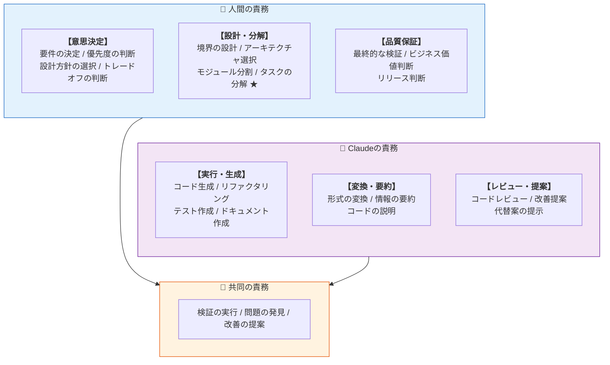

## 6. 役割分担モデル [L1]

### 核心:「判断は人間、実行はClaude、検証は両者」



### メタファー:人間はドライバー、Claudeはナビゲーター

役割分担を一言で表すと、**「人間はドライバー、Claudeはナビゲーター」**です。

```
┌─────────────────────────────────────────────────────────────────┐
│                 ドライバーとナビゲーター                         │
├─────────────────────────────────────────────────────────────────┤
│                                                                 │
│  ドライバー(人間)                                             │
│  ─────────────────                                              │
│  ・ハンドルを握り、最終的な操作を行う                           │
│  ・目的地を決める                                               │
│  ・ナビの提案を採用するか判断する                               │
│  ・いつでもナビを無視して自分の判断で進む権利を持つ             │
│  ・事故の責任を負う                                             │
│                                                                 │
│  ナビゲーター(Claude)                                         │
│  ─────────────────────                                          │
│  ・ルートを提案する                                             │
│  ・渋滞情報や天候を伝える                                       │
│  ・「次の交差点を右」と案内する                                 │
│  ・ドライバーの質問に答える                                     │
│  ・最終判断はしない                                             │
│                                                                 │
│  このメタファーの意味:                                          │
│  ────────────────────                                           │
│  ・ナビがどれだけ優秀でも、ハンドルを離してはいけない           │
│  ・ナビの提案は「正解」ではなく「選択肢」                       │
│  ・目的地に着く責任はドライバーにある                           │
│  ・ナビを使うことと、ナビに依存することは違う                   │
│                                                                 │
└─────────────────────────────────────────────────────────────────┘
```

> 💡 **プログラマーは常に「ドライバーシート」に座り続けるべき**
> — これはAI開発ツール「Cursor」の設計哲学でもあります。


### AI協働開発が可能にする「急がば回れ」

従来の開発では「丁寧にやりたい vs 時間がない」というジレンマがありました。
AI協働開発は、**丁寧にやるコストを劇的に下げる**ことで、このジレンマを解決します。

| 従来コストが高かった | AI協働では |
|---------------------|-----------|
| レビューを増やす | Claudeが即座にレビュー |
| テストを厚くする | Claudeがテスト生成 |
| 設計を練る | Claudeと壁打ち |
| ドキュメント整備 | Claudeが下書き生成 |
| 振り返り | 作業の流れの中で実施 |

> 💡 **AIがあるからこそ、丁寧にやれる。**
> 
> 「急がば回れ」の哲学については [Part 0: セクション2](./00-philosophy.md#2-急がば回れ--丁寧さと着実さ) を参照。

### フェーズ別の役割

```
┌─────────────────────────────────────────────────────────────────┐
│                    開発フェーズと役割分担                        │
│                                                                 │
│  フェーズ        人間                Claude                      │
│  ──────────     ──────              ────────                      │
│                                                                 │
│  企画・要件     ◉ 主導              ○ 支援(整理・質問)        │
│                 要件を決定          要件の明確化を支援          │
│                                                                 │
│  設計           ◉ 主導              ○ 支援(提案・検証)        │
│                 方針を決定          選択肢を提示                │
│                                                                 │
│  タスク分解     ◉ 主導              △ 参考意見                  │
│                 分解・境界定義      分解案の提示(参考程度)    │
│                                                                 │
│  実装           ○ 指示・検証        ◉ 主導                      │
│                 タスクを指示        コードを生成                │
│                                                                 │
│  テスト         △ 確認              ◉ 主導                      │
│                 結果を確認          テストを作成・実行          │
│                                                                 │
│  レビュー       ◉ 最終判断          ○ 支援(指摘)              │
│                 承認/却下           問題点を指摘                │
│                                                                 │
│  運用           ◉ 主導              ○ 支援(分析)              │
│                 判断・対応          ログ分析・提案              │
│                                                                 │
│  凡例: ◉ 主導  ○ 支援  △ 確認/参考                             │
└─────────────────────────────────────────────────────────────────┘
```

### なぜこの分担が重要か

```
人間が判断すべき理由:
  ・ビジネス価値はClaudeにはわからない
  ・ステークホルダーの期待を知っているのは人間
  ・最終責任は人間が負う
  ・タスクの適切な粒度は状況依存

Claudeが実行すべき理由:
  ・定型的な作業を高速にこなせる
  ・人間のミス(タイポ等)が減る
  ・24時間疲れない

検証が共同責務の理由:
  ・Claudeは自動検証(typecheck, test)を実行
  ・人間は結果を判断し、ビジネス観点で検証
  ・両者で品質を担保
```

---


---

← [タスク分解](./01c-task-decomposition.md) | [アンチパターン](./01e-antipatterns.md) →
