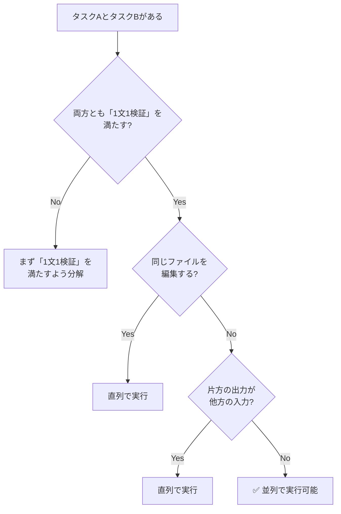
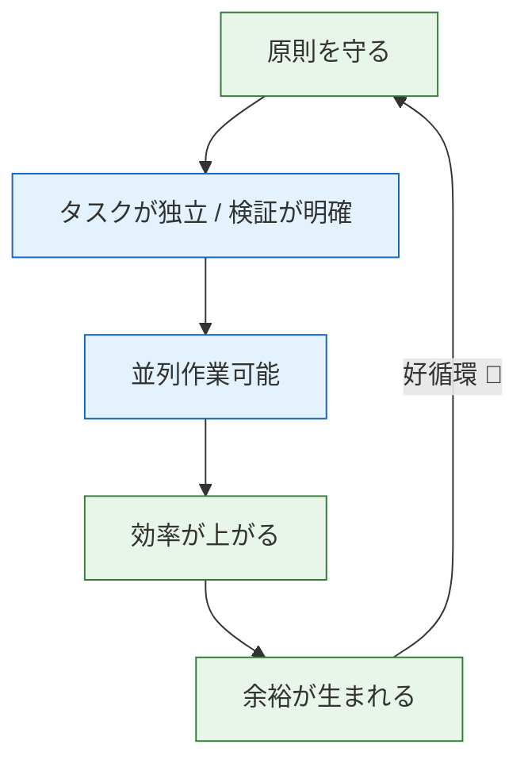

## 8. 効率と品質のバランス [L3]

### 核心:「急がば回れ」が生む最大効率

本フレームワークの原則を守ることで、**結果として**チームでの並列作業が可能になり、開発効率が最大化される。これは「急がば回れ」（H1-H3）の具体的な成果である。

```
┌─────────────────────────────────────────────────────────────────┐
│              「急がば回れ」の逆説的効率                          │
├─────────────────────────────────────────────────────────────────┤
│                                                                 │
│  原則を守る                        結果として得られる効率       │
│  ──────────                        ────────────────────────     │
│                                                                 │
│  「1文1検証」でタスクを分解    →  タスクが独立 → 並列化可能    │
│  検証基準を明確にする          →  コンフリクト最小化           │
│  CLAUDE.mdで知識を共有         →  チーム全員が同じ文脈で作業   │
│  型で仕様を明示する            →  インターフェースが安定       │
│                                                                 │
│  ────────────────────────────────────────────────────────────── │
│  核心: 効率は「目指すもの」ではなく「ついてくるもの」           │
│                                                                 │
└─────────────────────────────────────────────────────────────────┘
```

> 💡 **重要**: 効率の最大化を「目的」にすると、原則を省略する誘惑に負けやすい。
> 原則を守った「結果」として効率が得られることを忘れないでください。

### なぜ原則が並列作業を可能にするのか

**「1文1検証」原則がもたらす独立性**

```
┌─────────────────────────────────────────────────────────────────┐
│          「1文1検証」が並列作業を可能にする理由                  │
├─────────────────────────────────────────────────────────────────┤
│                                                                 │
│  1文1検証を満たすタスク                                         │
│  ─────────────────────                                          │
│  ・入力と出力が明確に定義されている                             │
│  ・検証基準が客観的で、誰がやっても同じ判定ができる             │
│  ・他のタスクへの依存が最小化されている                         │
│                                                                 │
│          ↓ これらの特性により                                   │
│                                                                 │
│  並列作業が安全に実行可能                                       │
│  ────────────────────────                                        │
│  ・タスクAの完了を待たずにタスクBを開始できる                   │
│  ・異なるメンバーが同時に作業してもコンフリクトしにくい         │
│  ・マージ時の統合が容易                                         │
│                                                                 │
└─────────────────────────────────────────────────────────────────┘
```

### 原則を守らないとどうなるか

```
┌─────────────────────────────────────────────────────────────────┐
│                    原則違反と並列作業の失敗                       │
├─────────────────────────────────────────────────────────────────┤
│                                                                 │
│  ❌ 原則を守らない場合                                          │
│  ──────────────────────                                          │
│                                                                 │
│  曖昧なタスク定義:                                              │
│  「認証機能を実装して」                                         │
│      ↓                                                          │
│  ・どこまでがタスクAの範囲か不明確                              │
│  ・メンバー間で認識がずれる                                     │
│  ・同じファイルを複数人が編集してコンフリクト                   │
│                                                                 │
│  検証基準がない:                                                │
│  「いい感じにお願い」                                           │
│      ↓                                                          │
│  ・完了の判断が主観的                                           │
│  ・マージ後に「思っていたのと違う」                             │
│  ・手戻りが発生し、結局遅くなる                                 │
│                                                                 │
│  ────────────────────────────────────────────────────────────── │
│                                                                 │
│  ✅ 原則を守った場合                                            │
│  ────────────────────                                            │
│                                                                 │
│  明確なタスク定義:                                              │
│  「UserエンティティをUser.tsに作成。                            │
│   email: string, passwordHash: stringを含む。                   │
│   検証: npx tsc --noEmit がエラー0で通ること」                  │
│      ↓                                                          │
│  ・範囲が明確で重複しない                                       │
│  ・別のメンバーはLoginAPIに集中できる                           │
│  ・並列作業が安全に実行可能                                     │
│                                                                 │
└─────────────────────────────────────────────────────────────────┘
```

### チーム並列作業の実際: Git worktree活用

原則を守るチームでは、Git worktreeを使って複数人が同時に作業できる。

**シナリオ: 4人チームで認証モジュールを開発**

```
┌─────────────────────────────────────────────────────────────────┐
│              Git worktree によるチーム並列作業                    │
├─────────────────────────────────────────────────────────────────┤
│                                                                 │
│  前提: CLAUDE.mdで設計方針とインターフェースが共有済み          │
│  前提: 各タスクは「1文1検証」を満たしている                      │
│                                                                 │
│  メンバーA (worktree: feature/user-entity)                      │
│  ──────────────────────────────────────────                      │
│  「Userエンティティを作成。検証: tsc --noEmit」                  │
│                                                                 │
│  メンバーB (worktree: feature/login-api)        ← 同時進行      │
│  ────────────────────────────────────────                        │
│  「POST /api/auth/login を実装。検証: テスト通過」              │
│                                                                 │
│  メンバーC (worktree: feature/jwt-service)      ← 同時進行      │
│  ──────────────────────────────────────────                      │
│  「JWTService を実装。検証: 単体テスト通過」                    │
│                                                                 │
│  メンバーD (worktree: feature/auth-middleware)  ← 同時進行      │
│  ────────────────────────────────────────────                    │
│  「認証ミドルウェアを実装。検証: 統合テスト通過」               │
│                                                                 │
│  ────────────────────────────────────────────────────────────── │
│  効果:                                                          │
│  ・4人が同時に作業 → 開発期間1/4（理論値）                      │
│  ・各自のコンテキストが軽量 → 品質維持                          │
│  ・検証基準が明確 → マージ時のコンフリクト最小                  │
│                                                                 │
└─────────────────────────────────────────────────────────────────┘
```

**Git worktree セットアップコマンド:**

```bash
# 各メンバーが自分のworktreeを作成
git worktree add ../project-feature-user -b feature/user-entity
git worktree add ../project-feature-login -b feature/login-api
git worktree add ../project-feature-jwt -b feature/jwt-service
git worktree add ../project-feature-middleware -b feature/auth-middleware

# 作業完了後
git worktree remove ../project-feature-user
```

### 個人開発でも並列作業は有効

チームでなくても、**一人で複数のターミナルを開いてClaude Codeセッションを並列実行できる**。
この方法を知らない開発者は意外と多いが、効果は絶大である。

```
┌─────────────────────────────────────────────────────────────────┐
│              個人開発での並列作業セットアップ                     │
├─────────────────────────────────────────────────────────────────┤
│                                                                 │
│  ステップ1: Git worktreeで作業ディレクトリを分離                │
│  ──────────────────────────────────────────────                  │
│  git worktree add ../my-app-auth -b feature/auth                │
│  git worktree add ../my-app-api -b feature/api                  │
│                                                                 │
│  ステップ2: 複数のターミナルウィンドウ(またはタブ)を開く       │
│  ─────────────────────────────────────────────────────────      │
│  ターミナル1: cd ../my-app-auth && claude                       │
│  ターミナル2: cd ../my-app-api && claude                        │
│                                                                 │
│  ステップ3: 各ターミナルで独立したタスクを実行                  │
│  ──────────────────────────────────────────────                  │
│  ターミナル1: 「Userエンティティを作成して...」                 │
│  ターミナル2: 「APIルーティングを設定して...」                  │
│                                                                 │
│  ポイント:                                                      │
│  ・Claudeが生成中の待ち時間を、別タスクの検証やレビューに使う   │
│  ・各セッションのコンテキストが独立しているので品質を維持       │
│  ・「1文1検証」を守っているから、コンフリクトが起きにくい       │
│                                                                 │
└─────────────────────────────────────────────────────────────────┘
```

**個人開発での並列パターン:**

| 状況 | セッション数 | 例 |
|------|-------------|-----|
| 待ち時間の活用 | 2 | 生成中に別タスクのレビュー |
| 設計と実装の分離 | 2 | 設計セッション + 実装セッション |
| 独立機能の並列 | 2-3 | 認証 + API + フロントエンド |

> 💡 **よくある誤解**: 「並列作業はチーム開発だけのもの」
> 実際には、個人開発者こそ並列作業の恩恵が大きい。
> 待ち時間を有効活用でき、1日の作業量が1.5〜2倍になることも珍しくない。

### 並列化の判断フロー



### まとめ: 品質と効率の好循環



> **逆に原則を省略すると**: 焦る → 原則省略 → 曖昧なタスク → 並列できない → 効率低下 → さらに焦る → ...（悪循環）

> 💡 並列作業の具体的な方法は [Part 3: セクション15](./03-practices.md#15-並列作業の原則) を参照。

---

← [アンチパターン](./01e-antipatterns.md) | [Part 1: マインドセット](./01-mindset.md) →
