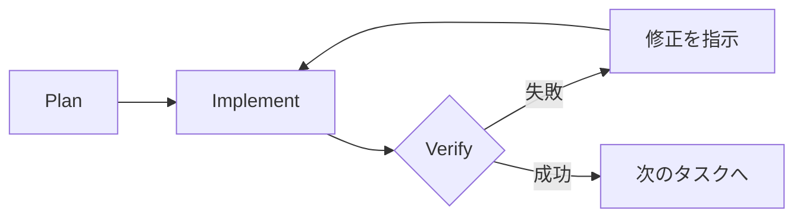

# Part 3: 実践手法

> **このPartでは**: 日々の開発で使うCLAUDE.mdの運用、タスク管理、検証ループ、Claude Code、MCP連携について解説します。
> 
> **読むタイミング**: 日々の開発作業中に参照

### レベル別ガイド

| レベル | このPartで読むべきセクション |
|-------|---------------------------|
| **L1(基礎)** | 12. CLAUDE.md、14. 検証ループ、まとめ |
| **L2(実践)** | L1 + 13. タスク管理、16. コンテキスト管理、17. Claude Code |
| **L3(最適化)** | 全体(15. 並列作業、18. MCP連携含む) |

### このPartと哲学の階層構造

| Level | 哲学 | このPartでの実践 |
|-------|------|-----------------|
| L0 目的 | **持続可能性** | CLAUDE.mdを育てる、学びを蓄積、並列作業で効率と品質を両立 |
| L1 環境 | **心理的安全性** | 失敗の分類と記録、損切りを「賢明な判断」として扱う |
| L2 態度 | **急がば回れ** | 検証フィードバックループ、3往復/30分の損切りライン |
| L3 手段 | **シンプルさ** | 1タスク1検証、コンテキストを軽量に保つ、明確な完了条件 |

### 3行で言うと

1. **CLAUDE.mdは「育てる」— 失敗したら即追記**
2. **検証は「小さく、頻繁に、早く」— 3往復/30分で損切り**
3. **独立タスクは並列で、コンテキスト60%超えたら分割**

> 💡 以下の詳細は読み飛ばしてもOK。迷ったときに戻ってきてください。

---

```
Part 3 の流れ:

品質を守る
├── 12. CLAUDE.mdの進化モデル
├── 13. タスク管理と優先度
└── 14. 検証フィードバックループと損切り

効率を上げる
├── 15. 並列作業の原則         ★新規
└── 16. コンテキスト管理戦略   ★新規

ツール活用
├── 17. Claude Code固有の注意点
└── 18. MCP連携
```

---

# 品質を守る

## 12. CLAUDE.md の進化モデル [L1]

### 核心:CLAUDE.md は「監視の憲法」

CLAUDE.mdは単なる「Claudeへの設定ファイル」ではありません。
**人間の監視をスケールさせる仕組み**です。

```
┌─────────────────────────────────────────────────────────────────┐
│          CLAUDE.md = Scalable Oversight（監視の拡張）            │
├─────────────────────────────────────────────────────────────────┤
│                                                                 │
│  従来の監視:                                                    │
│  ────────────                                                   │
│  人間 → [毎回確認] → Claudeの出力                               │
│                                                                 │
│  問題: 人間の時間は有限。すべてを確認できない。                 │
│                                                                 │
│  ────────────────────────────────────────────────────────────── │
│                                                                 │
│  CLAUDE.mdによる監視:                                           │
│  ────────────────────                                           │
│  人間 → [原則を定義] → CLAUDE.md → [原則を適用] → Claudeの出力  │
│                                                                 │
│  効果: 人間が一度定義した原則が、すべてのセッションに適用。     │
│       「毎回確認」から「原則で制御」へ。                        │
│                                                                 │
└─────────────────────────────────────────────────────────────────┘
```

**CLAUDE.mdに投資する価値**:

| 投資 | リターン |
|------|---------|
| 禁止事項を1回書く | すべてのセッションで違反を防げる |
| 判断基準を1回定義 | 人間がいなくてもClaudeが判断できる |
| 品質基準を1回明記 | レビュー負荷が軽減される |
| 失敗を1回記録 | 同じ失敗を二度としなくなる |

> **参考**: Anthropicは「少量の高品質な人間の監視を、AIの支援によって大規模に拡張する」
> ことを「Scalable Oversight」と呼んでいます。CLAUDE.mdはこの概念のプロジェクト実装です。

### CLAUDE.md は「育てる」もの

| フェーズ | 文字数 | 含める内容 |
|---------|-------|-----------|
| Phase 0(開始時) | 300〜500 | プロジェクト名、概要、技術スタック候補 |
| Phase 1(要件中) | 500〜1,000 | 主要機能一覧、ドキュメント構成、用語集 |
| Phase 2(設計完了) | 1,000〜1,500 | 技術スタック確定、アーキテクチャ、ディレクトリ構造 |
| Phase 3(製造中) | 1,500〜2,500 | 全コマンド、コーディングルール、禁止事項、Current Sprint |
| Phase 4(運用中) | 2,000〜3,000 | 運用知見、トラブルシューティング |

### 追記のトリガー

| 状況 | アクション |
|------|----------|
| Claudeに同じ説明を3回した | CLAUDE.mdに追記 |
| Claudeが同じミスを2回した | 禁止事項として追記 |
| 新しいコマンドを追加した | Commandsセクション更新 |
| 設計方針が変わった | Architecture更新 |
| スプリントが変わった | Current Sprint更新 |

### 失敗の定義と分類

CLAUDE.mdを更新する際、「何が失敗か」の認識をチームで統一することが重要です。
検証失敗(typecheck/lint/testの失敗)は**発見手段**であり、失敗の種類ではありません。
CLAUDE.mdに記録すべきは**根本原因**です。

```
┌─────────────────────────────────────────────────────────────────┐
│                    失敗の構造                                    │
├─────────────────────────────────────────────────────────────────┤
│                                                                 │
│  発見手段(どうやって気づいたか)                               │
│  ─────────────────────────────                                  │
│  ・typecheck / lint / test の失敗                               │
│  ・手動レビューでの指摘                                         │
│  ・実行時の動作確認                                             │
│                                                                 │
│              ↓ なぜ失敗したか?(これを記録する)               │
│                                                                 │
│  根本原因(CLAUDE.mdに記録すべき内容)                          │
│  ─────────────────────────────────                              │
│  ・仕様違反: 要件との不一致                                     │
│  ・規約違反: CLAUDE.md/コーディングルールとの不一致             │
│  ・コミュニケーション失敗: 同じ説明の繰り返し                   │
│                                                                 │
└─────────────────────────────────────────────────────────────────┘
```

#### 失敗の3分類

| 失敗の種類 | 定義 | 具体例 |
|-----------|------|--------|
| **仕様違反** | 要件・期待と異なる動作をした | APIのレスポンス形式が違う、バリデーションルールが違う |
| **規約違反** | CLAUDE.md/コーディングルールと不一致 | 命名規則に従っていない、禁止パターンを使用した |
| **コミュニケーション失敗** | 同じ説明を繰り返す必要があった | 用語の意味、設計方針、背景情報を何度も説明 |

#### 更新ルール

| 失敗の種類 | 更新トリガー | 更新先 | 更新例 |
|-----------|-------------|--------|--------|
| **仕様違反** | 同一パターンで2回 | 要件/ルールセクション | 「APIレスポンスは必ず`{ data, error }`形式」 |
| **規約違反** | 1回でも | 禁止事項を強調 | 既存ルールを上部に移動、具体例を追加 |
| **コミュニケーション失敗** | 3回 | 該当セクション | 用語集に追記、背景情報を明記 |

#### チーム運用時の追加ルール

チームでCLAUDE.mdを運用する場合、以下も定義しておくと混乱を防げます。

| 観点 | 推奨ルール |
|------|----------|
| **カウント単位** | チーム累計(誰かが2回経験したら更新) |
| **期間** | リセットしない(累積でカウント) |
| **更新の承認** | 追記は個人判断OK、削除・大幅変更はレビュー必須 |

> 💡 失敗を「誰のせいか」ではなく「何を記録すべきか」という観点で捉えることで、
>    CLAUDE.mdは継続的に改善されます。

### CLAUDE.md テンプレート

プロジェクトの進行に合わせて、以下のテンプレートを参考にCLAUDE.mdを育てていきます。

#### Phase 0: プロジェクト開始時(300〜500文字)

```markdown
# プロジェクト名

〇〇のための△△システム

## 目的
- (プロジェクトの目的を1-2行で)

## 技術スタック(候補)
- Frontend: React + TypeScript
- Backend: Node.js + NestJS
- Database: PostgreSQL

## 次のステップ
- 要件の詳細化
- アーキテクチャ決定
```

#### Phase 1: 要件定義中(500〜1,000文字)

```markdown
# プロジェクト名

〇〇のための△△システム

## 主要機能
1. ユーザー認証(ログイン、ログアウト、権限管理)
2. 研修管理(CRUD、ステータス管理)
3. 進捗追跡(受講記録、レポート)

## 用語集
- 研修(Training): 社内教育プログラムの単位
- 受講者(Participant): 研修を受ける社員

## ドキュメント構成
- docs/modules/auth/: 認証関連
- docs/modules/training/: 研修管理関連

## 技術スタック(候補)
- Frontend: React + TypeScript
- Backend: Node.js + NestJS
- Database: PostgreSQL
```

#### Phase 2: 設計完了時(1,000〜1,500文字)

```markdown
# プロジェクト名

〇〇のための△△システム

## Tech Stack
- Frontend: React 18, TypeScript 5, Vite, TailwindCSS
- Backend: NestJS, Prisma, PostgreSQL
- Testing: Vitest, Playwright

## Architecture
Modular Monolith + Clean Architecture

src/
├── modules/
│   ├── auth/           # 認証モジュール
│   ├── training/       # 研修管理モジュール
│   └── progress/       # 進捗管理モジュール
└── shared/             # 共通コード

## 主要機能
1. ユーザー認証
2. 研修管理
3. 進捗追跡

## 用語集
- Training: 研修プログラム
- Participant: 受講者

## ドキュメント参照
- docs/modules/{name}/requirements.md
- docs/modules/{name}/api.md
```

#### Phase 3: 製造中(1,500〜2,500文字)

```markdown
# プロジェクト名

〇〇のための△△システム

## Commands
npm install          # 依存関係インストール
npm run dev          # 開発サーバー起動
npm run typecheck    # 型チェック(実装後必須)
npm run lint         # Lint実行
npm run test         # テスト実行
npm run build        # ビルド

## Tech Stack
- Frontend: React 18, TypeScript 5, Vite, TailwindCSS
- Backend: NestJS, Prisma, PostgreSQL
- Testing: Vitest, Playwright

## Architecture
Modular Monolith + Clean Architecture

src/modules/{name}/
├── domain/           # エンティティ、リポジトリIF
├── application/      # ユースケース
├── infrastructure/   # リポジトリ実装
├── {name}.types.ts   # 型定義
└── index.ts          # 公開API

## Type Rules
// ID型はBranded Typeで区別
type UserId = string & { readonly __brand: 'UserId' }
type TrainingId = string & { readonly __brand: 'TrainingId' }

// エラーはResult型で返す(throwしない)
type Result<T, E> = { ok: true; value: T } | { ok: false; error: E }

// 外部入力はzodで検証(Single Source of Truth)
const UserSchema = z.object({ email: z.string().email() })
type User = z.infer<typeof UserSchema>

## Type Safety Rules(必読)
// 配列アクセス後は必ずundefinedチェック
const first = items[0]
if (first !== undefined) { /* 使用 */ }

// null/undefinedチェック必須
if (user !== null) { /* user.nameにアクセス可 */ }

// Discriminated Unionはswitch文で網羅的に処理
switch (state.status) {
  case 'idle': ...
  case 'loading': ...
  case 'success': ...  // state.dataにアクセス可
  case 'error': ...    // state.errorにアクセス可
}

// 型アサーション(as)は原則禁止 → 型ガードを使用
// ❌ const user = data as User
// ✅ if (isUser(data)) { const user = data }

## Coding Rules
// ✅ DO
type Status = 'draft' | 'active' | 'completed'  // Union型
function getTraining(id: string): Training | undefined  // 明示的戻り値
const config = { ... } as const  // 設定オブジェクトはas const

// ❌ DON'T
enum Status { Draft }           // enum禁止
function get(): any             // any禁止
data as any as User             // any経由のアサーション絶対禁止
// 1ファイル300行超え禁止

## 禁止事項
- console.log をコミットしない
- any 型の使用禁止
- as any / as Type でエラーを回避しない
- 未使用の import を残さない

## Current Sprint
Sprint 3: 認証機能の実装(優先度順)

1. [MUST] ログインAPI - POST /api/auth/login
2. [MUST] JWTトークン発行
3. [SHOULD] パスワードリセット
4. [COULD] ソーシャルログイン
```

#### Phase 4: 運用中(2,000〜3,000文字)

```markdown
# プロジェクト名

(Phase 3の内容に以下を追加)

## 運用知見

### よくある問題と解決策
1. DBマイグレーションエラー
   → `npm run prisma:reset` で解決

2. 型エラーが大量に出る
   → `node_modules` 削除 → `npm install`

### パフォーマンス注意点
- Training一覧は100件以上でページング必須
- N+1問題に注意(Prisma include使用)

## トラブルシューティング
| 症状 | 原因 | 解決策 |
|------|------|--------|
| ログインできない | JWT期限切れ | トークン再発行 |
| 画面が白い | ビルドエラー | コンソール確認 |
```

### 検証:CLAUDE.mdが正しく設定されているか

CLAUDE.mdを作成・更新したら、以下を確認します。

```bash
cat CLAUDE.md | head -30
```

**期待される出力:**

プロジェクト名、Commands、Tech Stackが表示されていれば成功です。

<details>
<summary>Claude Codeで認識されない場合</summary>

**確認事項:**

1. ファイル名が正確か確認:
```bash
ls -la CLAUDE.md
```
→ `CLAUDE.md`(大文字)であること

2. ファイルがプロジェクトルートにあるか確認:
```bash
pwd
ls CLAUDE.md
```

3. Claude Codeを再起動して、再度読み込ませる

</details>

---

## 13. タスク管理と優先度 [L2]

### タスク分解の例(Before/After)

```
❌ Before(悪い例)
「研修管理システムの認証機能を実装して」

✅ After(良い例)
「認証機能を以下の順序で実装してください:

 1. まずUserエンティティを作成してください
    - src/modules/auth/domain/entities/User.ts
    - 完了したらtypecheckを実行して結果を教えてください

 2. typecheckが通ったら、ログインAPIを実装してください
    - POST /api/auth/login
    - 完了したらtypecheck + lintを実行してください

 3. 最後にJWT発行を実装してください
    - 完了したら全テストを実行してください」
```

### Prompt Pattern の使い分け

| Pattern | 使う場面 | 例 |
|---------|---------|-----|
| Step-by-Step | 複数ステップの実装 | 「以下の順序で実装して...」 |
| Test First | バグが怖い機能 | 「まずテストを書いてから実装して」 |
| Explain First | 複雑なロジック | 「まずアプローチを説明して、承認したら実装して」 |
| Review Mode | コード理解 | 「このコードを読んで、問題点を指摘して」 |

### 優先度ラベル

```
[MUST]   - 必須。これがないと動かない
[SHOULD] - 推奨。品質・保守性に影響
[COULD]  - 任意。時間があれば対応
```

---

## 14. 検証フィードバックループとエラーリカバリー [L1]

### Boris Cherny氏の原則

> "give Claude a way to verify its work. If Claude has that feedback loop, it will 2-3x the quality of the final result."
> 
> — Boris Cherny(Anthropic Staff Engineer、Claude Code開発責任者)
>    [X/Twitter, 2026年1月2日](https://x.com/bcherny/status/2007179861115511237)

**スローガン:「信頼するな、検証せよ」**

Claudeに検証手段を与え、フィードバックループを回すことで、最終結果の品質が2〜3倍向上する。

### 検証フィードバックループ



### 階層的な検証

| 速度 | 検証レベル | 確認内容 |
|------|----------|---------|
| 最速(数秒) | typecheck | 構文・型の正しさ |
| 高速(数秒〜) | lint | スタイル・潜在バグ |
| 中速(数十秒) | unit test | 個々の関数の動作 |
| 低速(数分〜) | 統合test | モジュール間の連携 |

### 言語別検証コマンドと期待出力

#### TypeScript

**型チェック:**

```bash
npx tsc --noEmit
```

**期待される出力(成功時):**

```
(何も表示されない = エラーなし)
```

または、プロジェクト設定によっては:

```
✨ Done in 1.2s.
```

<details>
<summary>エラーが出た場合</summary>

**よくあるエラー:**

```
error TS2322: Type 'string' is not assignable to type 'number'
```
→ 変数の型と代入する値の型が一致していません。型定義を確認してください。

```
error TS2304: Cannot find name 'User'
```
→ インポート文が不足しています。`import { User } from './User'` を追加してください。

</details>

**Lint:**

```bash
npx eslint . --ext .ts,.tsx
```

**期待される出力(成功時):**

```
✔ No ESLint warnings or errors
```

<details>
<summary>エラーが出た場合</summary>

**よくあるエラー:**

```
error  'useState' is defined but never used  @typescript-eslint/no-unused-vars
```
→ 未使用のインポートを削除するか、実際に使用してください。

```
error  Missing return type on function  @typescript-eslint/explicit-function-return-type
```
→ 関数に戻り値の型を明示的に追加してください:
```typescript
function getName(): string { ... }
```

</details>

**テスト:**

```bash
npx vitest run
```

**期待される出力(成功時):**

```
 ✓ src/modules/auth/Login.test.ts (3 tests) 
 ✓ src/modules/user/User.test.ts (5 tests)

 Test Files  2 passed (2)
      Tests  8 passed (8)
   Duration  2.34s
```

<details>
<summary>テストが失敗した場合</summary>

**よくある失敗:**

```
AssertionError: expected 'draft' to equal 'active'
```
→ テストの期待値と実装の戻り値が異なります。テストが正しいか、実装が正しいかを判断し、適切な方を修正してください。

```
TypeError: Cannot read property 'id' of undefined
```
→ テスト対象のオブジェクトが正しく初期化されていません。モックやセットアップを確認してください。

</details>

#### Python

**型チェック:**

```bash
mypy .
```

**期待される出力(成功時):**

```
Success: no issues found in 15 source files
```

<details>
<summary>エラーが出た場合</summary>

```
error: Incompatible return value type (got "str", expected "int")
```
→ 関数の戻り値の型が定義と異なります。型ヒントまたは実装を修正してください。

</details>

**Lint:**

```bash
ruff check .
```

**期待される出力(成功時):**

```
All checks passed!
```

**テスト:**

```bash
pytest
```

**期待される出力(成功時):**

```
======================== 15 passed in 2.34s ========================
```

### エラーリカバリーパターン

#### typecheckエラーが大量の場合

Claudeへの指示:

```
「typecheckで15件のエラーが出ました。
 エラーを以下の観点で分類してください:
 - 根本原因となっているエラー
 - 連鎖的に発生しているエラー
 根本原因のエラーから順に修正してください。」
```

**期待される応答:**

Claudeがエラーを分類し、「このエラーを修正すれば、他の10件は解消されます」といった分析を提供します。

#### テストが通らない場合

Claudeへの指示:

```
「テストが失敗しました。
 期待値: { status: 'active' }
 実際値: { status: 'draft' }
 
 なぜこの差異が生じたか分析し、
 テストと実装のどちらを修正すべきか判断してください」
```

**期待される応答:**

Claudeが差異の原因を分析し、「テストの期待値が古い仕様です」または「実装のロジックに問題があります」と判断を示します。

### 損切りライン:撤退ルール

エラー修正の無限ループは開発者の士気を下げます。明確な撤退基準を設けましょう。

```
┌─────────────────────────────────────────────────────────────────┐
│                    損切りライン(撤退基準)                       │
├─────────────────────────────────────────────────────────────────┤
│                                                                 │
│  🚨 3回ルール                                                   │
│  ───────────                                                    │
│  同じエラーに対して3往復しても解決しない場合は撤退              │
│                                                                 │
│  撤退後のアクション:                                            │
│  1. AIを一旦離れ、人間がコードを書く                           │
│  2. 動くコードができたら、AIに「なぜ動くか解説して」と指示     │
│  3. 学びをCLAUDE.mdの禁止事項に追記                            │
│                                                                 │
│  🚨 時間ルール                                                   │
│  ───────────                                                    │
│  1つのエラー対応に30分以上かかったら撤退を検討                  │
│                                                                 │
│  🚨 複雑化ルール                                                 │
│  ─────────────                                                  │
│  修正するたびにコードが複雑になっていたら撤退                    │
│  → 問題の分解が足りていないサイン                              │
│                                                                 │
└─────────────────────────────────────────────────────────────────┘
```

| 状況 | 判断 | アクション |
|------|------|----------|
| 3往復で解決しない | 撤退 | 人間が書く → AIに解説させる |
| 30分以上経過 | 撤退検討 | 問題を再分解するか、人間が対応 |
| 修正で複雑化 | 撤退 | タスク分解からやり直し |
| 同じエラーが再発 | 撤退 | 根本原因の特定を人間が行う |

**撤退は敗北ではない。** AIの限界を知り、人間の判断で効率的にゴールに向かうためのスキルです。

### 損切り後の復帰フロー

撤退した後、どうやって再開するかが重要です。
以下の復帰フローに従うことで、同じ問題に再び陥ることを防ぎます。

```
┌─────────────────────────────────────────────────────────────────┐
│                    損切り後の復帰フロー                          │
├─────────────────────────────────────────────────────────────────┤
│                                                                 │
│  Step 1: 問題の分析(5-10分)                                   │
│  ──────────────────────────                                      │
│  ・何が起きたかを言語化する                                     │
│  ・「なぜ解決できなかったか」を考える                           │
│  ・問題の本質を特定する                                         │
│                                                                 │
│         ↓                                                       │
│                                                                 │
│  Step 2: アプローチの選択                                       │
│  ──────────────────────────                                      │
│  以下のいずれかを選択:                                         │
│                                                                 │
│  A. 人間が直接解決                                              │
│     → 自分でコードを書く                                       │
│     → 動いたらClaudeに「なぜ動くか解説して」と依頼             │
│                                                                 │
│  B. 問題を再分解                                                │
│     → より小さなタスクに分割                                   │
│     → 分割後の最小タスクから再挑戦                             │
│                                                                 │
│  C. コンテキストをリセット                                      │
│     → 新しいセッションを開始                                   │
│     → CLAUDE.mdに学びを追記してから再開                        │
│                                                                 │
│  D. エスカレーション                                            │
│     → チームメンバーに相談                                     │
│     → ペアプログラミングで解決                                 │
│                                                                 │
│         ↓                                                       │
│                                                                 │
│  Step 3: 学びの記録(必須)                                     │
│  ──────────────────────────                                      │
│  ・CLAUDE.mdに失敗パターンを追記                                │
│  ・次回の回避策を明記                                           │
│  ・チームで共有(該当する場合)                                 │
│                                                                 │
└─────────────────────────────────────────────────────────────────┘
```

#### アプローチ選択の判断基準

| 状況 | 推奨アプローチ | 理由 |
|------|---------------|------|
| 自分で解法がわかる | A: 人間が直接解決 | 最速で解決、学びも得られる |
| タスクが大きすぎた | B: 問題を再分解 | 根本原因に対処 |
| コンテキストが汚染されている | C: リセット | 新鮮な状態で再開 |
| 自分では判断できない | D: エスカレーション | 一人で抱えない |

#### エスカレーション基準

以下の場合は、一人で解決しようとせず、チームに相談しましょう。

```
┌─────────────────────────────────────────────────────────────────┐
│                    エスカレーション基準                          │
├─────────────────────────────────────────────────────────────────┤
│                                                                 │
│  🚨 即座にエスカレーション                                       │
│  ─────────────────────────                                       │
│  ・セキュリティに関わる問題                                     │
│  ・本番環境に影響する可能性がある                               │
│  ・データ損失のリスクがある                                     │
│                                                                 │
│  ⚠️ 30分以内にエスカレーション検討                               │
│  ──────────────────────────────                                  │
│  ・同じエラーで3回撤退した                                      │
│  ・問題の原因が全くわからない                                   │
│  ・自分のスキル範囲外と感じる                                   │
│                                                                 │
│  💡 日次/週次で共有                                              │
│  ─────────────────                                               │
│  ・繰り返し発生するパターン                                     │
│  ・CLAUDE.mdに追記した禁止事項                                  │
│  ・効果的だった対処法                                           │
│                                                                 │
└─────────────────────────────────────────────────────────────────┘
```

#### 復帰フロー実践例

**例: 型エラーが3往復で解決しなかった場合**

```
1. 問題の分析
   「配列のmapでundefinedチェックが漏れている。
    Claudeは毎回違う方法で対処しようとするが、根本解決に至らない」

2. アプローチ選択 → B: 問題を再分解
   「配列操作を別関数に切り出し、その関数だけに集中する」

3. 学びの記録
   CLAUDE.mdに追記:
   「## 禁止事項
    - 配列アクセス後のundefinedチェック省略は禁止
      → items[0]の後は必ず if (item !== undefined) でガード」

4. 再挑戦
   「src/utils/arrayHelpers.ts に安全な配列アクセス関数を作成してください。
    items[0]のような直接アクセスではなく、この関数を使うようにします」
```

> 💡 撤退後の復帰は「失敗からの学び」を形にする重要なプロセスです。
> CLAUDE.mdへの記録を省略しないでください。

### 検証タイミングの推奨

| タイミング | 実行する検証 |
|-----------|-------------|
| コード変更直後 | typecheck |
| 機能実装後 | typecheck + lint |
| タスク完了時 | typecheck + lint + test |
| PR/マージ前 | 全検証 + 手動確認 |

### 検証の原則

```
小さく: 1文1検証
頻繁に: 変更のたびに検証
早く:   最速の検証から始める
```

---

# 効率を上げる

## 15. 並列作業の原則 [L3]

### 核心:独立タスクは分けて同時に進める

```
┌─────────────────────────────────────────────────────────────────┐
│                    並列作業の効果                                │
├─────────────────────────────────────────────────────────────────┤
│                                                                 │
│  ❌ 直列作業(1セッションで全部)                                │
│  ─────────────────────────────────                              │
│  [設計] → [実装A] → [実装B] → [テスト]                         │
│  ────────────────────────────────────→ 4時間                   │
│  問題: コンテキストが肥大化、途中で圧縮が発生                   │
│                                                                 │
│  ✅ 並列作業(独立タスクを分離)                                 │
│  ──────────────────────────────                                  │
│  セッション1: [設計] ──────────────────→                        │
│  セッション2:          [実装A] ────────→                        │
│  セッション3:          [実装B] ────────→                        │
│  ──────────────────────────────────────→ 2時間                 │
│  効果: コンテキスト軽量、待ち時間を活用                         │
│                                                                 │
└─────────────────────────────────────────────────────────────────┘
```

### 並列パターン3選

| パターン | 説明 | 使い分け |
|---------|------|---------|
| 設計と実装の分離 | 設計セッション → 実装セッション | 大きな機能開発 |
| Code + Review | 実装セッションとレビューセッション | 品質重視の開発 |
| 独立機能の並列 | 別モジュールを同時に開発 | 複数機能の同時開発 |

### git worktrees セットアップ

並列作業には git worktrees が便利。同じリポジトリを複数ディレクトリで同時に作業できる。

```bash
# メインブランチから機能ブランチ用のworktreeを作成
git worktree add ../project-feature-auth -b feature/auth
git worktree add ../project-feature-api -b feature/api

# 作業完了後の削除
git worktree remove ../project-feature-auth

# worktree一覧の確認
git worktree list
```

**ディレクトリ構成例:**

```
~/projects/
├── my-app/                    # メイン(main/develop)
├── my-app-feature-auth/       # 認証機能開発用
└── my-app-feature-api/        # API開発用
```

各ディレクトリで別々のClaude Codeセッションを起動できる。

### 並列作業のルール

```
┌─────────────────────────────────────────────────────────────────┐
│                    並列作業のルール                              │
├─────────────────────────────────────────────────────────────────┤
│                                                                 │
│  ✅ やるべきこと                                                 │
│  ─────────────                                                  │
│  ・独立したモジュール/機能を並列化                              │
│  ・各セッションにCLAUDE.mdを共有                                │
│  ・定期的にgit pullで同期                                       │
│  ・マージ前に統合テストを実行                                   │
│                                                                 │
│  ❌ やってはいけないこと                                         │
│  ──────────────────                                              │
│  ・同じファイルを複数セッションで編集                           │
│  ・依存関係のあるタスクを同時に進める                           │
│  ・コンフリクトを放置してマージ                                 │
│  ・セッション間でコピペで同期(git使う)                        │
│                                                                 │
│  ⚠️ 特に注意: 型定義ファイルの変更                               │
│  ────────────────────────────────                                │
│  型定義(types.ts, *.d.ts)を変更する場合は要注意。             │
│  他のセッションが古い型定義のまま実装を進めると、               │
│  マージ時に型エラーが大量発生する。                             │
│                                                                 │
│  対策:                                                          │
│  ・型定義の変更は1つのセッションに集中                          │
│  ・変更したらすぐにコミット&他セッションでpull                 │
│  ・大きな型変更は他の並列作業を一時停止してから                 │
│                                                                 │
└─────────────────────────────────────────────────────────────────┘
```

### 推奨セッション数

| 状況 | セッション数 | 理由 |
|------|-------------|------|
| 個人開発・初心者 | 1-2 | まず1セッションに慣れる |
| 個人開発・慣れてきたら | 2-3 | 設計+実装、または独立機能 |
| 熟練者・大規模開発 | 3-5 | 待ち時間を最大限活用 |

> ⚠️ 注意: 並列数を増やしすぎると人間の認知負荷が上がる。
> 「管理できる範囲」を見極めることが重要。

---

## 16. コンテキスト管理戦略 [L2]

### 核心:コンテキストは「消耗品」として扱う

Claudeのコンテキストウィンドウは無限ではない。
**使い続けると性能が低下する**ため、計画的に管理する。

> 💡 以下の閾値(60%/75%)は**公式推奨値ではなく、ユーザーコミュニティの観察に基づく経験則**です。
> Claude Codeのコンテキストインジケーターは80%付近で表示され、自動圧縮は65-75%付近で発生することが報告されています。
> プロジェクトや作業内容に応じて調整してください。

```
┌─────────────────────────────────────────────────────────────────┐
│                コンテキストウィンドウの現実                       │
├─────────────────────────────────────────────────────────────────┤
│                                                                 │
│  使用率        状態              対策                           │
│  ────────      ────────          ────                           │
│                                                                 │
│  0-60%         快適              通常作業を継続                 │
│                性能低下なし                                     │
│                                                                 │
│  60-75%        要注意            セッション分割を検討           │
│                応答が遅くなる傾向                               │
│                考え中の表示が増える                             │
│                                                                 │
│  75%超         危険              新しいセッションを開始         │
│                ミスが増える傾向                                 │
│                以前の指示を忘れやすくなる                       │
│                                                                 │
│  確認方法: Claude Codeで /context コマンド                      │
│                                                                 │
└─────────────────────────────────────────────────────────────────┘
```

### セッション分割のタイミング

以下の兆候が見られたら、新しいセッションを開始する。

| 兆候 | 説明 |
|------|------|
| コンテキスト60%超 | `/context` で確認 |
| 「考え中」表示が増える | 処理が重くなっているサイン |
| 同じミスを2回する | 以前の指示を忘れている |
| 別のモジュールに移る | コンテキストをリセットするチャンス |
| 1日の作業開始時 | 前日のコンテキストは引き継がない |

### Explore-Plan-Code-Commit ワークフロー

設計と実装でセッションを分けることで、コンテキストを効率的に使う。

```
┌─────────────────────────────────────────────────────────────────┐
│            Explore-Plan-Code-Commit ワークフロー                 │
├─────────────────────────────────────────────────────────────────┤
│                                                                 │
│  【セッション1: 設計フェーズ】                                  │
│  ──────────────────────────                                      │
│  1. Explore: 要件を整理、既存コードを調査                       │
│  2. Plan: 実装方針を決定、タスクを分解                          │
│     └→ 結果をCLAUDE.mdまたはdocs/に記録                        │
│                                                                 │
│  【セッション2以降: 実装フェーズ】                              │
│  ────────────────────────────                                    │
│  3. Code: 設計に従って実装                                      │
│  4. Commit: 検証してコミット                                    │
│     └→ 独立タスクなら並列セッションも可                        │
│                                                                 │
│  効果:                                                          │
│  ・設計セッションは「考える」に集中(コード生成少ない)         │
│  ・実装セッションは「作る」に集中(設計済みで迷わない)         │
│  ・各セッションのコンテキストが軽量に保たれる                   │
│                                                                 │
└─────────────────────────────────────────────────────────────────┘
```

### コンテキスト管理チェックリスト

| タイミング | 確認項目 |
|-----------|---------|
| 作業開始時 | `/context` で現在の使用率を確認 |
| 30分ごと | コンテキスト使用率をチェック |
| モジュール切替時 | 新しいセッションを検討 |
| 「考え中」が増えたら | セッション分割を実行 |
| 1日の終わり | 翌日は新しいセッションで開始 |

---

# ツール活用

## 17. Claude Code 固有の注意点 [L2]

### Web版との違い

| 観点 | Web版 | Claude Code |
|------|-------|------------|
| ファイル操作 | 手動コピペ | 直接読み書き可能 |
| コマンド実行 | 手動実行 | 自動実行可能 |
| コンテキスト | 毎回伝える | CLAUDE.md自動読み込み |
| 適した作業 | 対話・相談 | 実装・リファクタ |

### Claude Code のベストプラクティス

```
1. 作業開始時の確認
「CLAUDE.md を読んで、現在のプロジェクト状況を把握してください」

2. 変更前の確認
「○○を変更する前に、現在の実装を読んで影響範囲を説明してください」

3. 段階的な実行
「まずtypecheckを実行して、現在の状態を確認してください」

4. 変更後の検証
「変更を保存したら、typecheck, lint, test を実行して結果を報告してください」
```

### 権限設定とセキュリティ

```
✅ 許可推奨
・ソースコードの読み取り(src/, tests/)
・検証コマンドの実行(typecheck, lint, test)
・ドキュメントの読み取り(docs/, README.md)

⚠️ 確認付きで許可
・ソースコードの書き込み
・新規ファイルの作成
・依存関係のインストール

❌ 禁止推奨
・環境変数/シークレットの読み取り
・本番環境へのアクセス
・システムファイルの変更
```

### セキュリティ設定例(.claude/settings.json)

```json
{
  "security": {
    "excludePatterns": [
      ".env*",
      "*.pem",
      "*.key",
      "**/secrets/**"
    ]
  },
  "permissions": {
    "allowedPaths": ["src/", "tests/", "docs/"],
    "deniedPaths": [".env*", "secrets/"]
  }
}
```

### 検証:設定が正しく適用されているか

設定ファイルを作成したら、以下を確認します。

```bash
cat .claude/settings.json | jq .
```

**期待される出力:**

```json
{
  "security": {
    "excludePatterns": [
      ".env*",
      "*.pem",
      "*.key",
      "**/secrets/**"
    ]
  },
  "permissions": {
    "allowedPaths": ["src/", "tests/", "docs/"],
    "deniedPaths": [".env*", "secrets/"]
  }
}
```

JSONが整形されて表示されれば、構文は正しいです。

<details>
<summary>エラーが出た場合</summary>

**JSONパースエラー:**
```
parse error: Expected separator between values at line 5, column 10
```
→ カンマの過不足やクォートの閉じ忘れを確認してください。

**ファイルが見つからない:**
```
cat: .claude/settings.json: No such file or directory
```
→ ディレクトリとファイルを作成してください:
```bash
mkdir -p .claude
touch .claude/settings.json
```

</details>

---

## 18. MCP連携のベストプラクティス [L3]

### MCPとは

MCP(Model Context Protocol)は、Claudeの機能を外部ツールやデータソースと連携させるためのプロトコルです。

### 開発で役立つMCPサーバー

| カテゴリ | MCP Server | できること |
|---------|-----------|----------|
| ファイル操作 | filesystem | ファイル読み書き、検索 |
| Git操作 | git | コミット、ブランチ操作 |
| データベース | postgres/mysql | クエリ実行、スキーマ確認 |
| ブラウザ | puppeteer | E2Eテスト、スクレイピング |
| ドキュメント | notion | ドキュメント検索・更新 |

### MCP設定の原則

```
1. 最小権限の原則
   ・必要なMCPサーバーのみ有効化
   ・読み取り専用で十分な場合は書き込み権限を与えない

2. 環境別の設定
   ・開発環境: より広い権限を許可
   ・本番環境: 読み取り専用、または接続しない

3. 監査ログ
   ・MCP経由の操作をログに記録
```

### 環境別MCP設定の推奨

| 環境 | filesystem | postgres | github |
|-----|-----------|----------|--------|
| 開発 | 読み書き可 | 読み取り専用 | 読み書き可 |
| ステージング | 読み取り専用 | 読み取り専用 | 読み取り専用 |
| 本番 | 接続禁止 | 接続禁止 | 接続禁止 |

### CLAUDE.mdへのMCP設定記載

```markdown
## MCP連携設定

### 有効なMCPサーバー
- filesystem: src/, docs/, tests/ のみアクセス可能
- postgres: 開発DBのみ(読み取り専用)

### MCP使用時の注意
- DBへのクエリは SELECT のみ
- ファイル作成時は必ず確認を求める
- 機密情報を含む可能性があるログは表示しない
```

### 検証:MCP接続が正しく動作しているか

MCPサーバーを設定したら、Claude Codeで以下を確認します。

**ファイルシステムMCPの確認:**

Claudeへの指示:
```
「MCPのfilesystemサーバーで、src/ディレクトリのファイル一覧を取得してください」
```

**期待される応答:**

```
src/ディレクトリには以下のファイルがあります:
- src/index.ts
- src/modules/
  - auth/
  - user/
...
```

ファイル一覧が表示されれば、MCP接続は成功です。

<details>
<summary>接続できない場合</summary>

**確認事項:**

1. MCPサーバーが起動しているか確認
2. 設定ファイルのパスが正しいか確認
3. 許可されたパスにsrc/が含まれているか確認

**よくあるエラー:**
```
MCP server 'filesystem' is not available
```
→ MCPサーバーの設定を確認し、必要に応じて再起動してください。

</details>

---

## Part 3 まとめ [L1]

```
┌─────────────────────────────────────────────────────────────────┐
│                  Part 3: 実践手法 まとめ                         │
├─────────────────────────────────────────────────────────────────┤
│                                                                 │
│  【品質を守る】                                                  │
│  CLAUDE.md       Phase 0-4 で段階的に育てる                     │
│  タスク管理      分解は人間、Prompt Patternを活用               │
│  検証ループ      小さく頻繁に、3往復/30分で損切り               │
│                                                                 │
│  【効率を上げる】                                                │
│  並列作業        独立タスクはworktreeで分離、2-3セッション      │
│  コンテキスト    60%超えたら分割、設計と実装でセッション分離    │
│                                                                 │
│  【ツール活用】                                                  │
│  Claude Code     自動読込、権限設定を適切に                     │
│  MCP連携        最小権限で安全に拡張                           │
│                                                                 │
├─────────────────────────────────────────────────────────────────┤
│                                                                 │
│  核心メッセージ:                                                │
│  「CLAUDE.md は育てるドキュメント」                              │
│  「検証は小さく、頻繁に、早く」                                  │
│  「独立タスクは並列で、コンテキストを守る」                      │
│  「Claude Code / MCP は権限設定が重要」                          │
│                                                                 │
└─────────────────────────────────────────────────────────────────┘
```

---

前のドキュメント: [Part 2: 設計指針](./02-design-principles.md)
次のドキュメント: [Part 4: 成長と定着](./04-growth-adoption.md)
