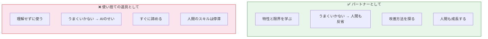
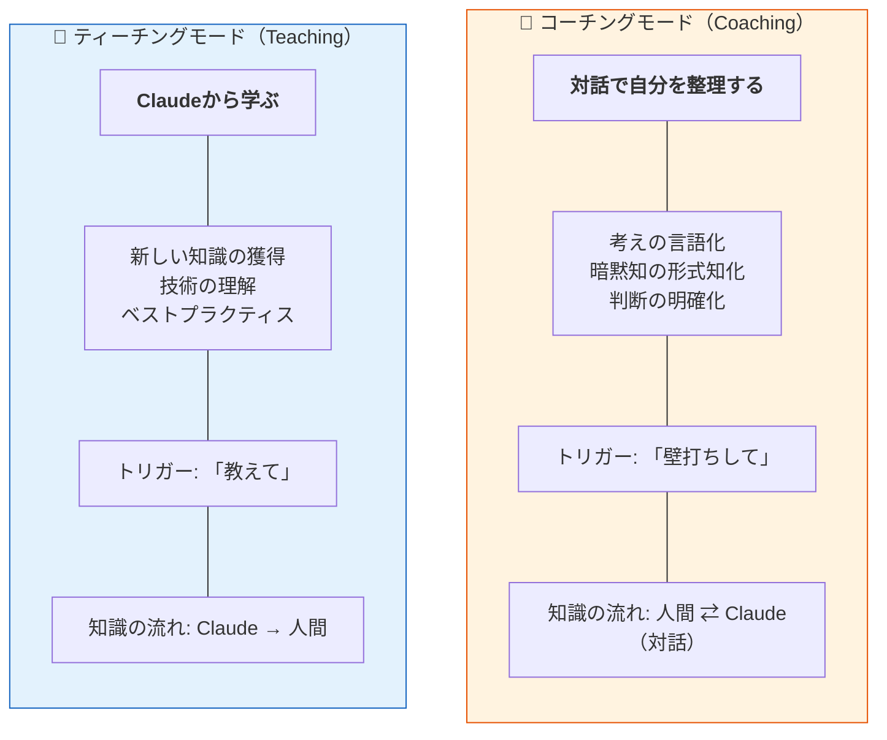
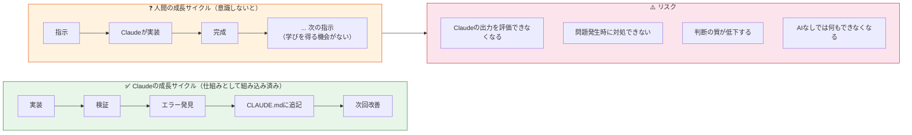

# Part 4: 成長と定着

> **このPartでは**: 人間とClaudeが一緒に成長するための振り返り、チームへの展開方法、実践のためのチェックリストを提供します。
> 
> **読むタイミング**: タスク完了時、スプリント終了時、月次振り返り時、チーム展開時

### レベル別ガイド

| レベル | このPartで読むべきセクション |
|-------|---------------------------|
| **L1(基礎)** | まとめのみ(Part 4は主にL2以上向け) |
| **L2(実践)** | 17. 相互学習、18. 人間の成長、21. チェックリスト |
| **L3(最適化)** | 全体(19. チーム展開、20. 効果測定含む) |

### このPartと哲学の階層構造

| Level | 哲学 | このPartでの実践 |
|-------|------|-----------------|
| L0 目的 | **持続可能性** | 相互学習モデル、ティーチング&コーチング、人間とAIの共成長 |
| L1 環境 | **心理的安全性** | 失敗を学びに変える文化、チーム規範の明文化 |
| L2 態度 | **急がば回れ** | 3層の振り返り(5分/30分/1時間)、段階的なチーム展開 |
| L3 手段 | **シンプルさ** | チェックリストで確認事項を明確化、習熟度レベルの明確な定義 |

### 3行で言うと

1. **AIはパートナー — 力を引き出す責任は人間にある**
2. **タスク完了時に5分振り返り — 「自分で説明できるか?」**
3. **チーム展開は3フェーズで段階的に**

> 💡 以下の詳細は読み飛ばしてもOK。迷ったときに戻ってきてください。

---

## 17. 相互学習モデル:AIとの責任あるパートナーシップ [L2]

### 核心:AIを「使い捨ての道具」ではなく「理解すべきパートナー」として



> 「パートナー」とは対等という意味ではない。「理解し、真剣に向き合う」という姿勢のこと。

> **重要**: 「パートナー」と呼ぶからといって、以下が変わるわけではありません:
> - 主導権は常に人間(ドライバーシートの原則)
> - 最終判断は人間が行う(Bright Line BL1)
> - AIなしでも成立する状態を維持する(可逆性の原則)
>
> 「パートナー」が意味するのは、**高度な能力を持つAIを活かせないのは、
> 人間側の理解不足や怠慢である**という自覚を持つことです。
> 詳細は [Part 0: 引き出す責任](./00-philosophy.md#引き出す責任aiの力を活かすのは人間の責任-l1) を参照。

AI協働開発の真価は、単なる生産性向上ではない。
**人間がAIの力を引き出しながら、自らも成長する関係**を構築することにある。

### 2つの学習モード

AI協働における学習には、2つの異なるモードがある。
目的に応じて使い分けることで、学習効果を最大化できる。



| モード | 目的 | 人間の姿勢 | 適した場面 |
|--------|------|-----------|-----------|
| ティーチング | 知識の獲得 | 学習者 | 新技術習得、概念理解 |
| コーチング | 思考の整理 | 主体者 | 設計判断、問題分析 |

### ティーチングモード:Claudeから学ぶ

新しい知識や技術を効率的に習得するためのモード。

#### 効果的なプロンプト例

**概念の理解:**
```
「TypeScriptのジェネリクスについて教えてください。

以下の形式でお願いします:
1. 一言で説明(初心者向け)
2. なぜ必要なのか(動機)
3. 具体的なコード例(3段階で複雑に)
4. よくある間違い
5. 私の理解度を確認する質問を3つ」
```

**設計判断の学習:**
```
「このコードでRepository patternを使った理由を教えてください。

知りたいこと:
- このパターンの目的
- 使わない場合との比較
- どういう場合に採用すべきか
- 私が今後判断できるようになるためのチェックリスト」
```

**ベストプラクティスの習得:**
```
「エラーハンドリングのベストプラクティスを教えてください。

条件:
- TypeScript + NestJS環境
- 私のコード(添付)を例として使って
- 「なぜそうするのか」を重視
- アンチパターンも併せて」
```

#### ティーチングモードのポイント

| ポイント | 説明 |
|---------|------|
| 「なぜ」を聞く | 単なる方法ではなく、理由を理解する |
| 段階的に深める | 基礎→応用→エッジケースの順で |
| 自分の言葉で確認 | 「つまり〇〇ということ?」と言い換える |
| 実践と紐づける | 「私のコードだとどう適用できる?」 |

### コーチングモード:対話で思考を整理する

自分の考えを言語化し、整理するためのモード。
**Claudeは答えを与えるのではなく、思考を促す役割を担う。**

#### 効果的なプロンプト例

**設計の壁打ち:**
```
「認証機能の設計について壁打ちさせてください。

現状の考え:
- JWT + リフレッシュトークン
- Redis でセッション管理

迷っている点:
- トークンの有効期限をどう設定するか
- ログアウト時の処理

あなたの役割:
- 私の考えを整理する質問をしてください
- 判断を下すのは私です
- 選択肢と各々のトレードオフを提示してください」
```

**問題分析の整理:**
```
「パフォーマンス問題について整理を手伝ってください。

状況:
- APIレスポンスが遅い(3秒以上)
- 原因の仮説は複数ある

お願いしたいこと:
1. 私の仮説を聞いて、抜け漏れを指摘
2. 優先順位付けの観点を提示
3. 各仮説の検証方法を一緒に考える

※ 答えを出すのではなく、私の思考を整理してください」
```

**判断の言語化:**
```
「マイクロサービス vs モノリスの判断を整理したいです。

私の現在の傾向:モノリスから始める

理由(まだ曖昧):
- チームが小さい
- ドメインが固まっていない

お願い:
- 私の理由を深掘りする質問をしてください
- 判断基準を明確にする手伝いをしてください
- 最終判断は私がします」
```

#### コーチングモードのポイント

| ポイント | 説明 |
|---------|------|
| 主体は自分 | Claudeは思考を促す、決めるのは自分 |
| 曖昧なまま始める | 整理されていなくてOK、対話で明確化 |
| 「なぜ」を問われる | 自分の判断理由を言語化する機会 |
| 結論を急がない | プロセスを重視、思考の質を上げる |

### なぜ2つのモードが効果的か

- **コーチングモード** = 自分の考えを言語化する(暗黙知→形式知)
- **ティーチングモード** = 学んだ知識を身につける(形式知→暗黙知)

この循環により、AIを使いながら人間も成長できます。

> 💡 この循環はSECIモデル（野中郁次郎, 1995）の知識変換プロセスに基づいています。

### 学習モードの使い分け

| 状況 | 推奨モード | 理由 |
|------|-----------|------|
| 新しいライブラリを学ぶ | ティーチング | 知識がないので教わる |
| 設計方針を決める | コーチング | 判断は自分、整理が必要 |
| エラーの原因を探る | 両方 | 知識(T)+ 分析整理(C) |
| コードレビューを依頼 | ティーチング | 問題点を指摘してもらう |
| 要件の優先度を決める | コーチング | ビジネス判断は自分 |
| リファクタリング方針 | 両方 | 手法(T)+ 判断(C) |

### コーチング/ティーチング判断キーワード集

リアルタイムで「今どちらのモードを使うべきか」を判断するためのキーワード集です。

#### ティーチングモードのトリガーキーワード

**自分の発言に以下が含まれたら → ティーチングモード:**

```
┌─────────────────────────────────────────────────────────────────┐
│            ティーチングモード トリガーキーワード                  │
├─────────────────────────────────────────────────────────────────┤
│                                                                 │
│  知識不足系                                                      │
│  ──────────                                                      │
│  「〇〇って何?」「〇〇の意味がわからない」                      │
│  「〇〇の使い方を教えて」「〇〇のベストプラクティスは?」        │
│  「〇〇と△△の違いは?」「〇〇はどういう場面で使う?」           │
│                                                                 │
│  スキル不足系                                                    │
│  ──────────                                                      │
│  「〇〇の書き方がわからない」「〇〇のエラーが解決できない」      │
│  「〇〇のコードを見せて」「〇〇の実装例が欲しい」                │
│  「〇〇をレビューして」「〇〇の問題点を指摘して」                │
│                                                                 │
│  確認系                                                          │
│  ────────                                                        │
│  「これで合ってる?」「この理解で正しい?」                      │
│  「〇〇のパターンはこれでいい?」                                │
│                                                                 │
└─────────────────────────────────────────────────────────────────┘
```

#### コーチングモードのトリガーキーワード

**自分の発言に以下が含まれたら → コーチングモード:**

```
┌─────────────────────────────────────────────────────────────────┐
│             コーチングモード トリガーキーワード                   │
├─────────────────────────────────────────────────────────────────┤
│                                                                 │
│  判断・決定系                                                    │
│  ────────────                                                    │
│  「〇〇と△△、どちらがいいか迷っている」                        │
│  「〇〇にすべきか判断できない」「優先度をどうつけるべきか」     │
│  「〇〇の方針を決めたい」「〇〇のアプローチを整理したい」        │
│                                                                 │
│  思考整理系                                                      │
│  ──────────                                                      │
│  「考えがまとまらない」「頭の中を整理したい」                    │
│  「壁打ちしたい」「相談に乗って」                                │
│  「〇〇について話を聞いて」                                      │
│                                                                 │
│  理由・根拠系                                                    │
│  ────────────                                                    │
│  「なぜ〇〇にしたか説明できない」「〇〇の理由を言語化したい」    │
│  「この判断でいいか確認したい(根拠を整理したい)」              │
│                                                                 │
│  ビジネス判断系                                                  │
│  ──────────────                                                  │
│  「この機能は必要か」「どこまでやるべきか」                      │
│  「スコープをどう切るか」「何を優先すべきか」                    │
│                                                                 │
└─────────────────────────────────────────────────────────────────┘
```

#### セルフチェック質問

作業中に「今どちらのモードか」を判断するための質問です。

```
┌─────────────────────────────────────────────────────────────────┐
│                    セルフチェック質問                             │
├─────────────────────────────────────────────────────────────────┤
│                                                                 │
│  Q1: 今、自分に足りないのは?                                   │
│      ├─ 知識・スキル → ティーチング                             │
│      └─ 整理・言語化 → コーチング                               │
│                                                                 │
│  Q2: Claudeに何を期待している?                                  │
│      ├─ 答えを教えてほしい → ティーチング                       │
│      └─ 質問で整理してほしい → コーチング                       │
│                                                                 │
│  Q3: 最終判断を誰がする?                                        │
│      ├─ Claudeでいい(正解がある)→ ティーチング               │
│      └─ 自分がする(正解がない)→ コーチング                   │
│                                                                 │
│  Q4: 今、手が止まっている理由は?                                │
│      ├─ やり方がわからない → ティーチング                       │
│      └─ 方針が決められない → コーチング                         │
│                                                                 │
└─────────────────────────────────────────────────────────────────┘
```

#### モード切替の実践例

**例1: エラー対応中のモード切替**

```
状況: TypeScriptの型エラーが出ている

Step 1: 「このエラーの意味を教えて」
        → ティーチング(知識不足)

Step 2: 「なるほど。じゃあ修正方法を教えて」
        → ティーチング(スキル不足)

Step 3: 「修正方法がA案とB案あるのか。どちらがいいか壁打ちして」
        → コーチング(判断が必要)

Step 4: 「B案でいくことにした。実装を見せて」
        → ティーチング(実装例が必要)
```

**例2: 設計検討中のモード切替**

```
状況: 新機能の設計を考えている

Step 1: 「認証にJWTを使いたい。JWTの仕組みを教えて」
        → ティーチング(知識不足)

Step 2: 「JWTとセッションベースの違いは?」
        → ティーチング(比較知識)

Step 3: 「うちのシステムにはどちらが合うか整理したい」
        → コーチング(判断が必要)

Step 4: 「JWTでいく。実装パターンを教えて」
        → ティーチング(スキル獲得)
```

#### 間違ったモードを使っているサイン

| サイン | 問題 | 対処 |
|--------|------|------|
| Claudeが長々と説明するが、ピンとこない | コーチングが必要なのにティーチングを受けている | 「壁打ちして」に切り替える |
| Claudeに質問されるが、答えられない | ティーチングが必要なのにコーチングを受けている | 「まず〇〇を教えて」に切り替える |
| 同じところをぐるぐる回っている | モードが合っていない、または両方必要 | 「今どちらのモードが適切か」を明示的に判断 |
| 判断を委ねたくなる | コーチングで整理できていない | 「選択肢を整理して」に切り替える |

> 💡 モードの切替は会話の途中で何度でも行ってOKです。
> 「今、ティーチングモードで教えて」「コーチングモードに切り替えて」と明示的に伝えることも有効です。

### 相互学習を促進するプロンプトパターン

#### パターン1: 説明を求める(ティーチング)

```
「〇〇を実装してください。

実装後、以下を説明してください:
- なぜこの設計にしたか
- 却下した代替案とその理由
- この設計の弱点・将来の課題
- 私が理解すべき重要な概念」
```

#### パターン2: 選択肢を提示させる(コーチング支援)

```
「〇〇を実装する方法を3つ提示してください。

各方法について:
- メリット・デメリット
- 適した状況
- 私のプロジェクトへの適合度

最終選択は私が行います。」
```

#### パターン3: 理解度確認を組み込む(ティーチング)

```
「〇〇を実装してください。

実装後、私の理解度を確認する質問を3つしてください。
私が答えられなかった場合は、追加で説明してください。」
```

#### パターン4: 壁打ち相手になってもらう(コーチング)

```
「〇〇について壁打ちさせてください。

私の現状の考え:
(ここに記載)

あなたの役割:
- 私の考えを深掘りする質問をする
- 抜け漏れを指摘する
- 判断は私が行う」
```

### チーム展開への波及

相互学習モデルは個人の成長だけでなく、チーム全体の知識循環を促進する。

```
┌─────────────────────────────────────────────────────────────────┐
│                  チームへの波及効果                              │
├─────────────────────────────────────────────────────────────────┤
│                                                                 │
│  個人の学習                      チームへの展開                  │
│  ──────────                      ────────────                    │
│  コーチングで言語化    →    CLAUDE.md、ドキュメントに記録        │
│                              ↓                                  │
│                         チームメンバーが参照                    │
│                              ↓                                  │
│  ティーチングで習得    ←    知識が循環・蓄積                    │
│                                                                 │
│  結果:                                                         │
│  ・属人化の解消(暗黙知が形式知になる)                         │
│  ・オンボーディングの効率化                                     │
│  ・チーム全体のスキル向上                                       │
│                                                                 │
└─────────────────────────────────────────────────────────────────┘
```

### 相互学習モデルのまとめ

```
┌─────────────────────────────────────────────────────────────────┐
│                 相互学習モデル まとめ                            │
├─────────────────────────────────────────────────────────────────┤
│                                                                 │
│  核心メッセージ:                                                │
│  「AIはパートナー。真剣に向き合い、力を引き出す責任は人間にある」│
│                                                                 │
│  2つのモード:                                                   │
│  ・ティーチング: Claudeから学ぶ(知識獲得)                     │
│  ・コーチング: 対話で整理する(暗黙知→形式知)                  │
│                                                                 │
│  使い分けの原則:                                                │
│  ・知識がない → ティーチング                                    │
│  ・判断が必要 → コーチング                                      │
│  ・両方必要なことも多い                                         │
│                                                                 │
│  目指す状態:                                                    │
│  ・AIを使うほど、人間も成長する                                 │
│  ・暗黙知が形式知化され、チームに蓄積される                     │
│  ・「AIがないと何もできない」ではなく「AIと共により高く」        │
│                                                                 │
│  忘れてはいけないこと:                                          │
│  ・AIがうまく使えないのは、人間側の問題でもある                 │
│  ・主導権と責任は常に人間側にある                               │
│  ・可逆性を維持する(AIなしでも成立する状態)                   │
│                                                                 │
└─────────────────────────────────────────────────────────────────┘
```

---

## 18. 人間の成長と振り返り [L2]

### なぜ人間の成長が重要か



> 💡 セクション17「相互学習モデル」で紹介した **ティーチングモード** と **コーチングモード** を
> 日常的に活用することで、このリスクを回避できます。

### 振り返りの3層構造

| 層 | タイミング | 所要時間 | 確認内容 |
|----|-----------|---------|---------|
| Layer 1 | タスク完了時 | 5分 | 「このコード、自分で説明できるか?」 |
| Layer 2 | スプリント終了時 | 30分 | 「指示の出し方は改善できるか?」 |
| Layer 3 | 月次 | 1時間 | 「1ヶ月前より成長したか?」 |

#### Layer 1: タスク完了時の振り返り(5分)

```
確認観点:
□ このコードの動作を他人に説明できるか?
□ なぜこの設計になったか理解しているか?
□ 新しく学んだことはあるか?

→ 説明できない場合:ティーチングモードで質問
  「この実装の〇〇の部分を説明してください」
```

#### Layer 2: スプリント終了時の振り返り(30分)

```
確認観点:
□ 指示の出し方で改善できる点はあったか?
□ 同じ説明を何度もしていないか?(→ CLAUDE.mdに追記)
□ Claudeの誤りのパターンはあったか?(→ 禁止事項に追記)

→ 判断に迷った場面があれば:コーチングモードで壁打ち
  「〇〇の判断について振り返りたいのですが、壁打ちしてください」
```

#### Layer 3: 月次の振り返り(1時間)

```
確認観点:
□ 1ヶ月前にできなかったことができるようになったか?
□ Claudeへの依存度は適切か?
□ 自分で判断・実装できる範囲は広がったか?
```

##### 期待値0から始める成長モデル — 今どの段階にいるか?

> 💡 詳細は [00a-introduction.md](./00a-introduction.md) の「期待値0から始める成長モデル」を参照

月次の振り返りでは、自分が今どの段階にいるかを確認しましょう。

```
┌─────────────────────────────────────────────────────────────────┐
│         成長の5段階（調整期を含む） — 自己評価チェックリスト     │
├─────────────────────────────────────────────────────────────────┤
│                                                                 │
│  ■ 段階0: 調整期（期待値 0→-10→0）← Jカーブの底               │
│  ─────────────────────────────────                              │
│  □ AIを使い始めて「思ったより難しい」と感じた経験がある        │
│  □ 期待通りにいかなくても「これは学びの入り口」と捉えられる    │
│  □ 調整期は正常なプロセスだと理解している                      │
│  □ 諦めずに続ける意思がある                                    │
│                                                                 │
│  → 4つ中3つ以上で「段階1: 理解」へ                             │
│                                                                 │
│  ■ 段階1: 理解（期待値 0→20）                                  │
│  ─────────────────────────────                                  │
│  □ AIの得意なこと・不得意なことを3つ以上説明できる             │
│  □ 期待通りでなくても「なぜだろう」と冷静に考えられる          │
│  □ CLAUDE.mdの役割と重要性を理解している                       │
│  □ 「期待値0」の意味を理解し、実践しようとしている             │
│                                                                 │
│  → 4つ中3つ以上で「段階2: 実践」へ                             │
│                                                                 │
│  ■ 段階2: 実践（期待値 20→50）                                 │
│  ─────────────────────────────                                  │
│  □ Claudeと小さなタスクを完了した経験が5回以上ある             │
│  □ 「こう指示すればうまくいく」パターンを3つ以上持っている     │
│  □ 失敗をCLAUDE.mdに記録し、次に活かした経験がある             │
│  □ タスク分解を意識して実践している                            │
│                                                                 │
│  → 4つ中3つ以上で「段階3: 習熟」へ                             │
│                                                                 │
│  ■ 段階3: 習熟（期待値 50→80）                                 │
│  ─────────────────────────────                                  │
│  □ タスク分解が自然にできる（Type判定に迷わない）              │
│  □ Claudeとの協働が日常の一部になっている                      │
│  □ 検証サイクル（実装→typecheck→test）が習慣化している        │
│  □ Claudeの出力の問題点に気づき、適切に修正できる              │
│                                                                 │
│  → 4つ中3つ以上で「段階4: 波及」へ                             │
│                                                                 │
│  ■ 段階4: 波及（期待値 80→100）                                │
│  ─────────────────────────────                                  │
│  □ 他の人にAI協働の価値と方法を説明できる                      │
│  □ チームメンバーにノウハウを共有している                      │
│  □ CLAUDE.mdをチームの資産として育てている                     │
│  □ 新しいメンバーのオンボーディングを支援できる                │
│                                                                 │
│  → AI協働の伝道者として、組織に価値を波及させている            │
│                                                                 │
└─────────────────────────────────────────────────────────────────┘
```

##### 段階別の次のアクション

| 現在の段階 | 次の1ヶ月で意識すること |
|-----------|------------------------|
| **調整期** | 小さな成功体験を1つ作る、「難しい」を記録する |
| **理解** | 小さなタスクを3つ以上Claudeと完了する |
| **実践** | 失敗を恐れず記録する、パターンを言語化する |
| **習熟** | 後輩や同僚に1回以上教える機会を作る |
| **波及** | チームのCLAUDE.mdを改善する提案をする |

##### 成長が停滞していると感じたら

```
停滞のサイン:
  ・1ヶ月前と同じ段階のまま
  ・チェックリストの達成数が増えていない
  ・Claudeとの協働がルーティン化して学びがない

対処法:
  1. 意図的に新しいタスクに挑戦する
  2. ティーチングモードで「なぜ?」を深掘りする
  3. 他の人の使い方を観察する
  4. このフレームワークを読み直して新しい視点を得る
```

### 意図的な学習機会

```
1. 時々、手動で実装してみる
   → Claudeの出力と比較して学ぶ

2. Claudeに「なぜ?」を聞く
   → 理解を深める(ティーチングモード)

3. Claudeの出力を修正してみる
   → 手を動かすことで定着

4. 教える機会を作る
   → 理解の確認と定着

5. 判断の理由を言語化する
   → コーチングモードで壁打ち
```

---

## 19. チーム展開ガイド [L3]

### チーム展開時によくある課題

| 課題 | 内容 |
|------|------|
| スキル差 | AIツールの経験がバラバラ |
| 品質のばらつき | 人によって指示の質が違う |
| ナレッジの分断 | 個人のノウハウがチームに共有されない |

### 習熟度レベルの定義

| Level | 状態 | 特徴 |
|-------|------|------|
| 1: 初心者 | AIツール未経験 | プロンプトの書き方がわからない |
| 2: 基礎習得 | 基本的な指示は出せる | 複雑なタスク分解に苦労 |
| 3: 実践者 | 効果的な指示を出せる | CLAUDE.mdを適切に更新できる |
| 4: 熟練者 | 複雑なタスクを分解できる | 他メンバーを指導できる |

### Level別の学習カリキュラム

#### Level 1 → Level 2(2-4週間)

- 本フレームワークのPart 1を読む
- Claudeの得意/苦手を理解する
- 簡単な指示を出す練習
- 検証コマンドの実行を覚える
- 先輩とペアで小さなタスクを実行

**修了条件**: 1人で小さなタスクを検証込みで完了できる

#### Level 2 → Level 3(1-2ヶ月)

- Part 2, 3を読む
- Prompt Patternを全て試す
- 中規模タスクを自分で分解
- CLAUDE.mdに追記する経験を積む

**修了条件**: 中規模タスクを1人で分解・実行・検証できる

#### Level 3 → Level 4(2-3ヶ月)

- Part 4を読む
- 複数モジュールに跨るタスクを担当
- ベストプラクティスの改善提案
- Level 1-2のメンバーをメンタリング

**修了条件**: 複雑なタスクを自律的に完遂し、他メンバーを指導できる

### 習熟度レベル判定チェックリスト

修了条件だけでは判断が曖昧になりがちです。
以下のチェックリストを使って、客観的にレベルを判定できます。

#### Level 1 → Level 2 判定チェックリスト

**スキルチェック(すべてYesで合格):**

- [ ] Claudeに指示を出し、応答を得られる
- [ ] 検証コマンド(typecheck/lint/test)を実行できる
- [ ] エラーメッセージを読んで、Claudeに修正を依頼できる
- [ ] CLAUDE.mdの存在と役割を理解している
- [ ] Claudeの得意なこと・苦手なことを3つ以上説明できる

**実践テスト:**

```
課題: 「簡単な関数を実装し、検証まで完了する」

具体例:
「src/utils/greeting.ts に、名前を受け取って挨拶を返す関数を作成してください。
 完了したらtypecheckを実行して結果を報告してください」

合格基準:
✅ 関数が正しく実装されている
✅ typecheckを自分で実行した
✅ エラーがあれば修正を依頼できた
✅ 最終的に検証が通った

所要時間目安: 15-30分
```

#### Level 2 → Level 3 判定チェックリスト

**スキルチェック(すべてYesで合格):**

- [ ] 中規模タスク(30分〜1時間)を自分で2-3個のサブタスクに分解できる
- [ ] Prompt Pattern(Step-by-Step, Test First等)を使い分けられる
- [ ] 損切りライン(3往復/30分)を意識して行動できる
- [ ] CLAUDE.mdに禁止事項や学びを追記した経験がある
- [ ] Claudeの出力の問題点を指摘できる(幻覚、省略など)
- [ ] 検証失敗時に、根本原因を分析して修正依頼できる

**実践テスト:**

```
課題: 「中規模機能を分解し、検証込みで実装する」

具体例:
「ユーザープロファイル機能を実装してください。
 - ユーザー情報の取得API
 - 更新API
 - バリデーション
 ※ タスク分解、検証、CLAUDE.md更新まで含みます」

合格基準:
✅ タスクを3つ以上のサブタスクに分解できた
✅ 各サブタスク完了時に検証を実行した
✅ 問題発生時に適切に対処した(修正依頼 or 損切り)
✅ 学びをCLAUDE.mdに記録した

所要時間目安: 1-2時間
```

#### Level 3 → Level 4 判定チェックリスト

**スキルチェック(すべてYesで合格):**

- [ ] 複数モジュールに跨るタスクを、依存関係を考慮して分解できる
- [ ] コンテキスト管理(セッション分割、worktree活用)を実践している
- [ ] ティーチング/コーチングモードを意図的に使い分けている
- [ ] Level 1-2のメンバーに指導した経験がある
- [ ] CLAUDE.mdの改善提案をチームに行った経験がある
- [ ] AI協働開発の効果を定量的に説明できる(時間短縮、品質向上など)

**実践テスト:**

```
課題: 「複雑な機能を設計から実装まで主導し、知見を共有する」

具体例:
「認証機能を設計・実装し、実装過程をドキュメント化してください。
 - 設計方針の決定
 - タスク分解(5個以上)
 - 実装・検証
 - 学びの共有(チームへの発表 or ドキュメント)」

合格基準:
✅ 設計判断の理由を説明できる
✅ 複雑な機能を適切な粒度に分解できた
✅ 並列作業やセッション分割を活用した
✅ 他メンバーが参考にできるドキュメントを作成した
✅ 失敗パターンと対策をCLAUDE.mdに反映した

所要時間目安: 半日〜1日
```

### セルフアセスメント用クイックテスト

現在の習熟度を素早く判定するための質問集です。

```
┌─────────────────────────────────────────────────────────────────┐
│                セルフアセスメント(5分で判定)                    │
├─────────────────────────────────────────────────────────────────┤
│                                                                 │
│  Q1: Claudeにどのような指示を出していますか?                   │
│      □ 何を書けばいいかわからない            → Level 1         │
│      □ 「〇〇を実装して」程度               → Level 1-2       │
│      □ 検証コマンドの実行も含めて指示       → Level 2-3       │
│      □ タスク分解 + Prompt Pattern活用      → Level 3-4       │
│                                                                 │
│  Q2: エラーが出たときどうしますか?                             │
│      □ 何をすればいいかわからない            → Level 1         │
│      □ そのままClaudeに聞く                 → Level 1-2       │
│      □ エラーを分析して修正方針を伝える     → Level 2-3       │
│      □ 損切り判断を含めて対処できる         → Level 3-4       │
│                                                                 │
│  Q3: CLAUDE.mdについてどう思いますか?                          │
│      □ 何のことかわからない                  → Level 1         │
│      □ 存在は知っているが更新したことがない → Level 1-2       │
│      □ 自分で追記した経験がある             → Level 2-3       │
│      □ チームで運用ルールを提案できる       → Level 3-4       │
│                                                                 │
│  Q4: 他の人にAI協働開発を教えられますか?                       │
│      □ 教えられない                          → Level 1-2       │
│      □ 基本的なことなら教えられる           → Level 2-3       │
│      □ 効果的なプラクティスを含めて指導可能 → Level 3-4       │
│                                                                 │
│  判定: 最も多く該当したレベルがあなたの現在地です               │
│                                                                 │
└─────────────────────────────────────────────────────────────────┘
```

> 💡 レベル判定は厳密に行う必要はありません。
> 「次のレベルに必要なスキル」を明確にし、学習目標を設定することが目的です。

### チーム展開の3フェーズアプローチ

学習コストを抑えながら効果を最大化する段階的導入モデル。
**重要な教訓**: 適切な研修なしの組織は、AI導入の効果を十分に得られない傾向がある。

```
┌─────────────────────────────────────────────────────────────────┐
│               チーム展開の3フェーズモデル                        │
├─────────────────────────────────────────────────────────────────┤
│                                                                 │
│  Phase 1                Phase 2                Phase 3          │
│  基盤構築              ワークフロー統合        高度活用          │
│  (1-4週間)             (5-12週間)             (13週間〜)        │
│                                                                 │
│  ┌─────────┐          ┌─────────┐          ┌─────────┐        │
│  │コード補完│    →    │テスト生成│    →    │エージェント│      │
│  │+チャット │          │+リファクタ│          │型開発    │      │
│  └─────────┘          └─────────┘          └─────────┘        │
│                                                                 │
│  【目標】              【目標】              【目標】           │
│  全員がログイン        反復作業削減          サイクルタイム     │
│  1回以上使用          テンプレート共有       短縮              │
│                                                                 │
└─────────────────────────────────────────────────────────────────┘

※ 以下の数値は目標値であり、実績はチーム・プロジェクトにより異なります。
```

#### Phase 1: 基盤構築(1-4週間)

| 項目 | 内容 |
|------|------|
| **目標** | 最小限の機能で全員が使える状態にする |
| **導入機能** | コード補完 + チャットデバッグのみ |
| **成功指標** | 全員がツールにログインし、1回以上使用 |

**必須トレーニング(1日で習得可能):**
- 明確で具体的なタスク指示の書き方
- 何をAIに渡してよいか/悪いかの判断(PII、機密除外)
- AI生成コードは必ず人間がレビューするルール

#### Phase 2: ワークフロー統合(5-12週間)

| 項目 | 内容 |
|------|------|
| **目標** | 標準ワークフローをチームに定着 |
| **導入機能** | テスト生成 + リファクタリング支援 |
| **成功指標(目標)** | 反復作業の削減、プロンプトテンプレート10個以上共有 |

**標準化項目:**
- CLAUDE.mdをリポジトリにコミット
- プロンプトライブラリの共有開始
- PRレビュー時のAIコードチェックリスト導入

#### Phase 3: 高度活用(13週間〜)

| 項目 | 内容 |
|------|------|
| **目標** | エージェント型開発への移行 |
| **導入機能** | Plan-Actモード分離、マルチタスク協調 |
| **成功指標(目標)** | サイクルタイム短縮、バグ率減少 |

**拡張項目:**
- Git worktreesによる並列作業
- Headlessモードでの自動化タスク
- MCPサーバー連携

### チーム展開の段階的計画

| Phase | 期間 | 参加者 | 目標 |
|-------|------|--------|------|
| 1: パイロット | 1-2ヶ月 | 2-3名 | ワークフローの検証と改善 |
| 2: 先行展開 | 1-2ヶ月 | チームの半数 | 本番プロジェクトでの実践 |
| 3: 全体展開 | 1-2ヶ月 | チーム全員 | 標準プラクティスとしての定着 |

### チームでのCLAUDE.md管理

```
更新ルール:
・追記: 誰でも可(PR経由)
・削除/大幅変更: レビュー必須
・週次で棚卸し(不要な項目の削除)

PRテンプレート:
## CLAUDE.md 更新
### 変更内容
(何を追加/変更/削除するか)

### 理由
(なぜこの変更が必要か)

### 影響
(この変更でどう改善されるか)
```

### ナレッジ共有の仕組み

| 仕組み | 頻度 | 内容 |
|--------|------|------|
| 週次共有会 | 週1回 15-30分 | 成功パターン・失敗から学んだこと共有 |
| ペアプログラミング | 週1-2回 30-60分 | Level差のあるメンバーでペア |
| 振り返りリポジトリ | 週次 | docs/retrospectives/ に記録 |
| Slackチャンネル | 随時 | #ai-development-tips |

---

## 20. 効果測定メトリクス [L3]

### なぜ効果測定が必要か

- 導入効果を可視化し、継続的改善につなげる
- 経営層・ステークホルダーへの説明材料
- 投資対効果(ROI)の判断根拠

**注意**: 初期3-6ヶ月は学習曲線があるため、一時的に生産性が低下する可能性がある。
ベースライン測定を導入前に必ず実施し、長期的なトレンドで評価すること。

### 3層メトリクス体系

```
┌─────────────────────────────────────────────────────────────────┐
│                    効果測定の3層構造                             │
├─────────────────────────────────────────────────────────────────┤
│                                                                 │
│  Layer 1: 利用メトリクス(先行指標)                            │
│  ─────────────────────────────────                              │
│  ・アクティブユーザー率                                         │
│  ・提案受入率(Suggestion Acceptance Rate)                     │
│  測定方法: ツールダッシュボード                                 │
│                                                                 │
│                           ↓                                     │
│                                                                 │
│  Layer 2: 影響メトリクス(中間指標)                            │
│  ─────────────────────────────────                              │
│  ・サイクルタイム(課題→完了)                                 │
│  ・PRマージ時間                                                 │
│  ・リワーク率(手戻り率)                                       │
│  測定方法: Git分析ツール                                        │
│                                                                 │
│                           ↓                                     │
│                                                                 │
│  Layer 3: 品質メトリクス(遅行指標)                            │
│  ─────────────────────────────────                              │
│  ・変更失敗率(Change Failure Rate)                            │
│  ・バグ率                                                       │
│  ・テストカバレッジ                                             │
│  測定方法: CI/CDパイプライン                                    │
│                                                                 │
└─────────────────────────────────────────────────────────────────┘
```

### メトリクス詳細

> 💡 以下の目標値は業界標準および学術研究に基づく目安です。自チームのベースラインを測定し、現実的な目標を設定してください。

| 層 | メトリクス | 測定方法 | 目標値(目安) | 根拠 |
|----|-----------|----------|---------------|------|
| 利用 | アクティブユーザー率 | ツールダッシュボード | 80%以上 | GitHub公式推奨基準 |
| 利用 | 提案受入率 | ツールダッシュボード | 30%以上 | 学術論文・大規模調査で確認 |
| 利用 | 並列セッション活用率 | 自己申告/ログ | 50%以上 | 経験則 |
| 影響 | サイクルタイム | Git分析ツール | 短縮傾向 | - |
| 影響 | PRマージ時間 | Git分析ツール | 短縮傾向 | - |
| 影響 | リワーク率 | Git分析ツール | 減少傾向 | - |
| 影響 | コンテキスト起因のミス | 自己申告 | 減少傾向 | - |
| 品質 | 変更失敗率 | CI/CD | 維持または改善 | - |
| 品質 | バグ率 | バグトラッカー | 減少傾向 | - |
| 品質 | テストカバレッジ | CI/CD | 維持または向上 | - |

#### 目標値の根拠

**アクティブユーザー率 80%以上**
- GitHub公式:採用フェーズ終了の基準として「80%以上のコミット済みライセンスがアクティブ」を推奨
- Opsera調査:複数企業のCopilot導入データで80%を確認
- GitHub-Accenture共同調査:同日IDE拡張機能インストール率81.4%

**提案受入率 30%以上**
- GitHub公式研究(934,533ユーザー):約30%
- ZoomInfo企業調査(arXiv:2501.13282、400名以上):33%
- ACM研究:利用期間により28.9%→34%に上昇

> 📚 参考: [GitHub - Measuring Impact of Copilot](https://resources.github.com/learn/pathways/copilot/essentials/measuring-the-impact-of-github-copilot/)

### 測定のタイミング

| フェーズ | 測定頻度 | 重点メトリクス |
|---------|---------|---------------|
| Phase 1(1-4週) | 週次 | アクティブユーザー率、提案受入率 |
| Phase 2(5-12週) | 隔週 | サイクルタイム、リワーク率 |
| Phase 3(13週〜) | 月次 | 全メトリクス |

### 効果測定のアンチパターン

| ❌ やりがち | ✅ 正しい方法 |
|-----------|-------------|
| 導入直後に効果を判断 | 3-6ヶ月のトレンドで評価 |
| コード行数で生産性を測る | サイクルタイムと品質で測る |
| 個人の生産性を比較 | チーム全体の傾向を見る |
| メトリクスだけで判断 | 定性的フィードバックも収集 |

---

## 21. 実践チェックリスト [L2]

### ファイル設計
- [ ] 1ファイル 200-300行目安(Clean Code: 200-500行を推奨)
- [ ] 1関数 30〜50行以下
- [ ] 関連ファイルは同一ディレクトリ(コロケーション)
- [ ] index.ts で公開APIを明示
- [ ] モジュール間の依存は index.ts 経由のみ

### 型設計
- [ ] any/unknown を避け、具体的な型を定義
- [ ] Union型で状態を明示(Discriminated Union推奨)
- [ ] 関数の引数・戻り値に型を明記
- [ ] 型定義は使用箇所の近くに配置
- [ ] ID型はBranded Typeで区別(UserId, OrderIdなど)
- [ ] エラーはResult型で戻り値として返す(例外throwより推奨)
- [ ] 外部入力(API、フォーム)はzodでランタイム検証
- [ ] tsconfig.jsonでstrict: trueを有効化
- [ ] @typescript-eslint/no-explicit-anyをerrorに設定

> 💡 型設計の詳細は [Part 2: セクション10](./02-design-principles.md#10-型設計指針aiとの契約としての型) を参照

### ドキュメント設計
- [ ] CLAUDE.md は 3,000文字以下(Boris Cherny氏:約2.5kトークン推奨)
- [ ] モジュールごとに要件/API/DBドキュメント
- [ ] 1ドキュメント 〜4,000文字(GitHub Copilot公式推奨)
- [ ] 重要な情報は先頭または末尾に配置
- [ ] 1回の会話での読み込み合計は〜30,000文字(経験則)

### タスク管理
- [ ] 優先度は人間が決定し、Claudeに明示
- [ ] タスク分解は人間が行う(最重要スキル)
- [ ] Current Sprint セクションで優先度を管理
- [ ] MoSCoW法(Must/Should/Could/Won't)で分類
- [ ] 1回の指示 = 1つの明確なタスク

### 検証サイクル
- [ ] コード変更後に必ず typecheck
- [ ] 機能実装後に lint 実行
- [ ] タスク完了時にテスト実行
- [ ] 検証失敗時は次に進まず修正
- [ ] PR/マージ前に全検証を実行

### 指示の出し方
- [ ] Prompt Patternを活用(Step-by-Step, Test First等)
- [ ] 優先度順にタスクを指示
- [ ] 参照すべきファイル/ドキュメントを明示
- [ ] 期待する出力形式を指定
- [ ] 検証コマンドの実行を含める

### アンチパターン回避
- [ ] ドキュメント丸投げをしていない
- [ ] 巨大ファイルを作っていない
- [ ] 曖昧な指示を出していない
- [ ] 口頭で前提を伝えていない
- [ ] 検証なしで連続実装していない
- [ ] Claudeを過信していない

### Claudeの誤りへの対策
- [ ] 幻覚(存在しないAPI)→ typecheckで検出
- [ ] 過剰一般化 → 要件との照合
- [ ] 過剰自信 → 必ず検証
- [ ] 省略(エッジケース)→ テストで確認

### PRレビュー: AI生成コード検証チェックリスト

AI生成コードには特有の問題パターンがある。
以下のチェックリストでレビュー品質を確保する。

#### 機能的正確性
- [ ] タスク要件を正しく満たしているか
- [ ] エッジケースが処理されているか
- [ ] 既存アーキテクチャパターンに従っているか

#### ハルシネーション検出
- [ ] インポートパッケージがnpm/PyPIに実在するか
- [ ] 呼び出しAPIメソッドが実際に存在するか
- [ ] ドキュメントと実際の動作が一致するか
- [ ] 設定オプションが公式ドキュメントに記載されているか

#### セキュリティ
- [ ] SQLインジェクション対策
- [ ] XSS対策
- [ ] APIキー・シークレットのハードコードなし
- [ ] ログへの機密情報出力なし
- [ ] 入力値の適切なバリデーション

#### AI特有の確認
- [ ] テストが削除/スキップされていないか
- [ ] 冗長または非効率なコードがないか
- [ ] 架空の設定オプションを使用していないか
- [ ] 過度に複雑な実装になっていないか
- [ ] コメントの内容がコードと一致しているか

### コンテキスト管理
- [ ] 長い会話(50ターン超)では新しい会話を開始
- [ ] 会話開始時にCLAUDE.mdの参照を指示
- [ ] 重要な決定は即時CLAUDE.mdに記録
- [ ] 定期的にリマインド(10-15ターンごと)
- [ ] コンテキスト使用率60%超えたらセッション分割
- [ ] 独立タスクはworktreeで並列実行を検討
- [ ] 設計と実装でセッションを分離

### 人間の成長
- [ ] Claudeに設計判断の説明を求める(ティーチングモード)
- [ ] 選択肢を提示させて自分で判断する
- [ ] タスク完了時に理解度を確認(5分)
- [ ] スプリント終了時に振り返り(30分)
- [ ] 月次で成長を確認(1時間)
- [ ] 時々、手動で実装して比較する
- [ ] 判断に迷ったらコーチングモードで壁打ち

### チーム展開(該当する場合)
- [ ] 習熟度レベルを把握している
- [ ] レベル別のサポートを提供している
- [ ] CLAUDE.mdの更新ルールが明確
- [ ] ナレッジ共有の仕組みがある
- [ ] 定期的な振り返りを実施している

---

## Part 4 まとめ [L1]

```
┌─────────────────────────────────────────────────────────────────┐
│                  Part 4: 成長と定着 まとめ                       │
├─────────────────────────────────────────────────────────────────┤
│                                                                 │
│  相互学習モデル   ティーチング&コーチングの使い分け             │
│  人間の成長       3層の振り返り、意図的な学習機会               │
│  チーム展開       3フェーズ導入、習熟度別アプローチ             │
│  効果測定         3層メトリクス(利用→影響→品質)             │
│  チェックリスト   日々の確認、AI生成コードのPRレビュー          │
│                                                                 │
├─────────────────────────────────────────────────────────────────┤
│                                                                 │
│  2つの学習モード:                                               │
│  ━━━━━━━━━━━━━━━                                                │
│  ティーチング  → Claudeから学ぶ(知識獲得)                     │
│  コーチング    → 対話で整理する(暗黙知→形式知)                │
│                                                                 │
│  3フェーズ導入モデル:                                           │
│  ━━━━━━━━━━━━━━━━━                                              │
│  Phase 1(1-4週)  → コード補完+チャット(基盤構築)              │
│  Phase 2(5-12週) → テスト生成+リファクタ(ワークフロー統合)    │
│  Phase 3(13週〜) → エージェント型開発(高度活用)               │
│                                                                 │
├─────────────────────────────────────────────────────────────────┤
│                                                                 │
│  核心メッセージ:                                                │
│  「AIはパートナー。力を引き出す責任は人間にある」                │
│  「AIがうまく使えないのは、人間側の問題でもある」                │
│  「チーム展開は段階的に、効果は長期で測定」                      │
│  「適切な研修がAI導入の効果を左右する」                          │
│  「チェックリストで品質を維持」                                  │
│                                                                 │
└─────────────────────────────────────────────────────────────────┘
```

---

前のドキュメント: [Part 3: 実践手法](./03-practices.md)
次のドキュメント: [付録A: ウォークスルー例](./appendix-a-walkthrough.md)
