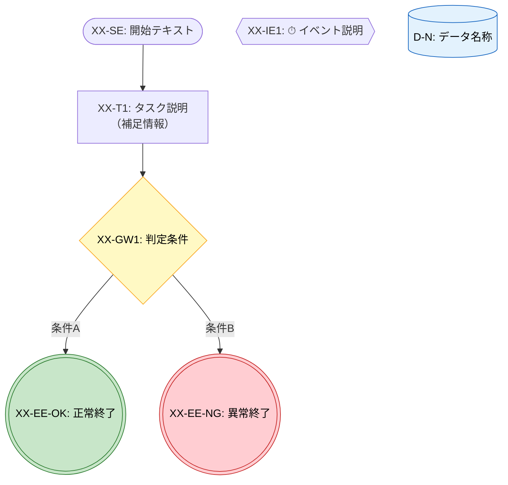

# Phase 1.5 T1: Mermaid記法統一ルール

> **タスク**: T4とT6のMermaid記法の差異をすべて列挙し、統一ルールを策定する
> **検証方法**: 統一ルール表にT4/T6間の全差異項目が網羅されており、各項目に統一方針が記載されていること
> **自信度**: 確実（差異は構造的に抽出済み、統一方針は承認済み）
> **入力**: `phase1-t4-mermaid-flowcharts.md`, `phase1-t6-losscut-recovery-mermaid.md`

---

## 1. 統一ルール一覧

| # | 要素 | T4の記法 | T6の記法 | 統一ルール | 採用元 | 理由 |
|---|------|---------|---------|-----------|--------|------|
| 1 | 開始イベント | `(["テキスト"])` スタジアム型 | `(("テキスト"))` 二重丸 | `(["テキスト"])` | T4 | 終了イベントと形状を区別し、BPMNの開始○と終了◎の視覚差を保つ |
| 2 | 終了イベント | `(("テキスト"))` 二重丸 | `((("テキスト")))` 三重括弧 | `((("テキスト")))` | T6 | 開始をスタジアム型にした場合、二重丸は開始と紛らわしい。三重括弧でBPMN◎を表現 |
| 3 | style指定 | なし | あり（配色ルール） | あり（全図に配色追加） | T6 | 視覚的な意味区分が可読性を大きく向上させる |
| 4 | ID命名 | `SE_1`, `GW_1` | `LC_SE`, `RF_T1` | プレフィックスベース | T6 | 数字サフィックスは図を跨ぐと衝突する。BPMN要素IDとの対応が明確 |
| 5 | データオブジェクト | 図外で参照表 | `[("名称")]` 図内配置 | 図内配置＋参照表も維持 | T6 | フロー内でデータの流れが視覚的に追える。参照表でメタ情報を補完 |
| 6 | 中間イベント | `{{テキスト}}` 六角形 | `[/"テキスト"/]` 台形 | `{{テキスト}}` 六角形 | T4 | 六角形は「特殊形状」として中間イベントの異質性を表現しやすい。台形は入出力と紛らわしい |
| 7 | 矢印ラベル記法 | `-->\|"ラベル"\|` | `-- "ラベル" -->` | `-->\|"ラベル"\|` | T4 | Mermaid公式で推奨される記法。パーサ互換性が安定 |
| 8 | コメント/セクション分け | なし | `%% ===== セクション =====` | コメントあり | T6 | 保守性・可読性の向上。Phase 2 XState変換時にもセクション境界が明確 |
| 9 | ノード内改行 | `\n` | 実際の改行（複数行テキスト） | `<br/>`（1行定義） | T4→v2修正 | Mermaid v11では`\n`がリテラル表示されるため`<br/>`を使用。1行で定義が完結し、diff/grep/置換に強い |

---

## 2. BPMN要素 → Mermaid形状 対応表（統一版）

| BPMN要素 | 記号 | Mermaid形状 | 記法 | 配色 |
|----------|------|------------|------|------|
| 開始イベント | ○ | スタジアム型 | `ID(["テキスト"])` | なし（デフォルト） |
| 終了イベント（正常） | ◎ | 三重括弧 | `ID((("テキスト")))` | `fill:#c8e6c9,stroke:#2e7d32,color:#000`（緑） |
| 終了イベント（異常/損切り） | ◎ | 三重括弧 | `ID((("テキスト")))` | `fill:#ffcdd2,stroke:#c62828,color:#000`（赤） |
| タスク | □ | 矩形 | `ID["テキスト"]` | なし（デフォルト） |
| タスク（必須/重要） | □ | 矩形 | `ID["テキスト"]` | `fill:#fff3e0,stroke:#e65100,color:#000`（オレンジ） |
| サブプロセス | □⊞ | サブルーチン型 | `ID[["テキスト"]]` | なし（デフォルト）または文脈色 |
| 排他ゲートウェイ | ◇ | 菱形 | `ID{"テキスト"}` | `fill:#fff9c4,stroke:#f9a825,color:#000`（黄） |
| 中間イベント | ○⏱/○! | 六角形 | `ID{{"テキスト"}}` | `fill:#ffe0b2,stroke:#e65100,color:#000`（オレンジ薄） |
| データオブジェクト | 📄 | シリンダー型 | `ID[("テキスト")]` | `fill:#e3f2fd,stroke:#1565c0,color:#000`（青） |

---

## 3. 配色ルール

| 意味 | 色 | fill | stroke |
|------|-----|------|--------|
| 成功/継続/正常終了 | 緑 | `#c8e6c9` | `#2e7d32` |
| 停止/損切り/異常終了 | 赤 | `#ffcdd2` | `#c62828` |
| 判定/ゲートウェイ | 黄 | `#fff9c4` | `#f9a825` |
| データオブジェクト | 青 | `#e3f2fd` | `#1565c0` |
| 必須タスク/注意 | オレンジ | `#fff3e0` | `#e65100` |
| 中間イベント | オレンジ薄 | `#ffe0b2` | `#e65100` |
| メインフロー復帰/参照 | 青薄 | `#bbdefb` | `#1565c0` |
| サブプロセス（文脈依存） | 紫 | `#e1bee7` | `#6a1b9a` |

全styleに共通: `color:#000`（テキスト色は黒で統一）

---

## 4. ID命名規則（統一版）

### 4.1 基本形式

```
{フロー接頭辞}_{要素種別}{連番またはサフィックス}
```

### 4.2 フロー接頭辞

| フロー | 接頭辞 | 例 |
|--------|--------|-----|
| メインフロー | `MF` | `MF_SE`, `MF_GW1` |
| SP-1: L0-L3チェック | `SP1` | `SP1_SE`, `SP1_T1` |
| SP-2: AIファーストチェック | `SP2` | `SP2_SE`, `SP2_T1` |
| SP-3: 検証フィードバックループ | `SP3` | `SP3_SE`, `SP3_T1` |
| タスク分解サブプロセス | `TD` | `TD_SE`, `TD_T1` |
| 損切り判断 | `LC` | `LC_SE`, `LC_T1` |
| 復帰フロー | `RF` | `RF_SE`, `RF_T1` |
| エスカレーション判断 | `ES` | `ES_SE`, `ES_T1` |

### 4.3 要素種別

| 種別 | 記号 | 例 |
|------|------|-----|
| 開始イベント | `SE` | `MF_SE` |
| 終了イベント | `EE` + サフィックス | `MF_EE_OK`, `LC_EE_CUT` |
| タスク | `T` + 連番 | `MF_T1`, `RF_T9` |
| サブプロセス | `SP` + 連番 | `MF_SP1` |
| ゲートウェイ | `GW` + 連番 | `MF_GW1`, `LC_GW3` |
| 中間イベント | `IE` + 連番 | `SP3_IE1` |
| データオブジェクト | `D` + 連番 | `D1`, `D6` |

### 4.4 BPMN要素IDとの対応

Mermaid IDはBPMN要素ID（ハイフン区切り）をアンダースコアに置換して生成する。

| BPMN要素ID | Mermaid ID |
|-----------|-----------|
| SE-1 | `MF_SE` |
| GW-1 | `MF_GW1` |
| T-1 | `MF_T1` |
| SP-1 | `MF_SP1` |
| EE-1 | `MF_EE_OK` |
| EE-2 | `MF_EE_CUT` |
| SP3-IE1 | `SP3_IE1` |
| LC-GW1 | `LC_GW1` |

---

## 5. Mermaid図テンプレート



---

## 6. T2/T3での適用時の変更サマリ

### 6.1 T4（T2で適用）に必要な変更

| 変更内容 | 対象範囲 |
|---------|---------|
| 開始イベント記法: 変更なし（既に`(["..."])`） | — |
| 終了イベント記法: `(("..."))` → `((("...")))`  | §1〜§6の全終了イベント |
| ID命名: メインフローの`SE_1`等を`MF_SE`等に変更 | §1メインフロー |
| style指定: 全図にT6準拠の配色を追加 | §1〜§6の全図 |
| データオブジェクト: §7の参照表を維持しつつ、関連する図内にも`[("...")]`で配置 | §1〜§6 + §7 |
| 中間イベント記法: 変更なし（既に`{{...}}`） | — |
| 矢印ラベル記法: 変更なし（既に`-->\|"..."\|`） | — |
| コメント追加: 全図にセクションコメントを追加 | §1〜§6の全図 |
| ノード内改行: `\n` → `<br/>`に変換（v2で修正済み） | §1〜§6の全ノード |

### 6.2 T6（T3で適用）に必要な変更

| 変更内容 | 対象範囲 |
|---------|---------|
| 開始イベント記法: `(("..."))` → `(["..."])` | §1〜§4の全開始イベント |
| 終了イベント記法: 変更なし（既に`((("...")))`） | — |
| ID命名: 変更なし（既にプレフィックスベース） | — |
| style指定: 変更なし（既に配色あり） | — |
| データオブジェクト: 変更なし（既に図内配置） | — |
| 中間イベント記法: `[/"..."/]` → `{{"..."}}`（§4統合図のみ） | §4の`SP3_IE1`, `SP3_IE2` |
| 矢印ラベル記法: `-- "..." -->` → `-->\|"..."\|` | §1〜§4の全ラベル付き矢印 |
| コメント追加: 変更なし（既にコメントあり） | — |
| ノード内改行: 複数行テキスト → `<br/>`に変換 | §1〜§4の該当ノード |

---

## 7. 検証チェックリスト

- [x] 引き継ぎ要約の既知6項目がすべて統一ルールに含まれている
- [x] 追加発見3項目（矢印ラベル記法、コメント、ノード内改行）が含まれている
- [x] 全9項目に統一方針・採用元・理由が記載されている
- [x] BPMN要素→Mermaid形状の統一対応表が作成されている
- [x] 配色ルールが体系的に定義されている
- [x] ID命名規則が明確に定義されている
- [x] T2/T3での適用時に必要な変更が具体的に列挙されている
- [x] テンプレートが提供されている

---

## 出典

- `phase1-t4-mermaid-flowcharts.md` — T4成果物（メインフロー6図の現状記法）
- `phase1-t6-losscut-recovery-mermaid.md` — T6成果物（損切り/復帰4図の現状記法）
- `phase1-t3-bpmn-elements.md` — BPMN要素定義（形状対応の原典）
- `phase1_5-and-phase2-task-breakdown.md` — Phase 1.5タスク定義
