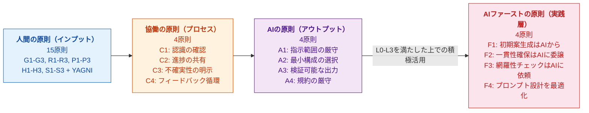
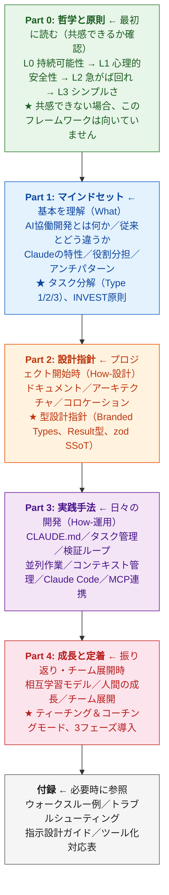

# AI協働開発フレームワーク v4.8

**〜持続可能な協働のための哲学と実践〜**

> **免責事項**: このフレームワークは個人が作成したコミュニティリソースであり、
> Anthropic社の公式ドキュメントではありません。
> 「Claude」はAnthropic社の製品名です。
> 内容の正確性については最善を尽くしていますが、保証するものではありません。

[](https://creativecommons.org/licenses/by/4.0/)

> このフレームワークは、AIを活用したシステム開発における哲学・原則・実践を体系化したものです。
> 主にClaudeを例に説明していますが、考え方は他のAIにも適用できます。

---

## 本フレームワークの哲学

このフレームワークは、**「AIは人間を置き換えるのではなく増強する」**という哲学に基づき、
5つの原則を**階層構造**で捉えています。

> 「AIは使えない」という懐疑論でも「AIに全て任せる」という万能論でもない——
> **従来のソフトウェア工学の知恵とAIの力を統合した第三の道**を提示します。

| Level | 哲学 | 一言で |
|-------|------|--------|
| L0 目的 | **持続可能性** | 人間とAIが共に成長し続ける関係を築く |
| L1 環境 | **心理的安全性** | 失敗を恐れない環境が、確実な前進を可能にする |
| L2 態度 | **急がば回れ** | 丁寧に、しかし着実に。AIがあるからこそ、丁寧にやれる |
| L3 手段 | **シンプルさ** | 複雑さは敵。人間がAIに与えるべきものは、究極的にシンプルな思考 |
| L4 実践 | **AIファースト** | L0-L3を守った上で、AIの強みを最大限に活用する |

**上位Levelが常に優先され、L4はL0-L3の制約内で最適化されます。**

### v4.8の新機能 ★NEW★

v4.8では、AI協働における「**無慈悲な親切心**」を言語化し、BL4の因果的役割を補足しました:

| 追加内容 | 説明 |
|---------|------|
| **無慈悲な親切心（補足コラム）** | AIの親切心が構造的に無慈悲さを生む現象の定義と対処 |
| **自覚を支える3つの柱** | 疑う姿勢・学習習慣・倫理観による思考の防衛線 |
| **BL4因果関係の補足** | BL4がBL1-BL3違反の根底にある認知的態度であることの説明 |

> 📖 詳細は [00i-merciless-kindness.md](./00i-merciless-kindness.md) を参照

#### v4.7で追加済みの概念

v4.7では、「増強の双方向性」を追加し、各哲学層が防いでいる**負の増幅**を明示しました:

| 追加内容 | 説明 |
|---------|------|
| **増強の双方向性** | 増強のメカニズムは正も負も等しく増幅する |
| **各層の防御構造** | L0-L4がそれぞれ特定の負の増幅を防ぐ防御線であることを明示 |
| **L4の唯一性** | L4のみが他の層による抑制を必要とする層であることの説明 |

> 📖 詳細は [00b-augmentation.md](./00b-augmentation.md) を参照

#### v4.6で追加済みの概念

v4.6では、「1文1検証」に**反証（falsification）的思考**の視点を追加しました:

| 追加内容 | 説明 |
|---------|------|
| **反証的構造** | ポパーの反証主義とDijkstraの洞察の構造的同型性 |
| **検証と反証の違い** | 「正しいことの確認」と「間違いを積極的に探す」の認識論的差異 |
| **フレームワーク内の反証マップ** | 既存要素（フェイルファスト、F3、損切り等）を反証概念で再解釈 |

> 📖 詳細は [00e-haste-simplicity.md](./00e-haste-simplicity.md) を参照

#### v4.5で追加済みの概念

v4.5では、「増強の哲学」の**歴史的源流**と「1文1検証」の**ソフトウェア工学的根拠**を追加しました:

| 追加内容 | 説明 |
|---------|------|
| **人間-コンピュータ協働の知的系譜** | Licklider (1960)、Engelbart (1962) からの65年の系譜 |
| **「1文1検証」のソフトウェア工学的根拠** | OSSのPull Requestモデルとの同型性 |
| **歴史的教訓** | Engelbartの矮小化と「引き出す責任」の接続 |

> 📖 詳細は [00b-augmentation.md](./00b-augmentation.md)、[00e-haste-simplicity.md](./00e-haste-simplicity.md) を参照

#### v4.4で追加済みの概念

v4.4では、「**ソフトウェア工学の解放**」という新しい概念を追加し、このフレームワークの存在意義を明確化しました:

| 追加内容 | 説明 |
|---------|------|
| **宣言** | 「ソフトウェア工学の解放 — AIが開く実践への扉」 |
| **7つの解放される実践** | TDD、ドキュメント維持、設計レビュー、リファクタリング、ペアプログラミング、コードレビュー、形式的仕様記述 |
| **品質の民主化** | 敷居を下げ、共通の品質水準を実現 |
| **土壌を準備する責任** | 言語化・分解・検証・蓄積の4要素 |

> 📖 詳細は [00h-engineering-liberation.md](./00h-engineering-liberation.md) を参照

#### v4.3で追加済みの概念

v4.3では、調査レポートの概念を**100%反映**し、SOLID原則等の設計原則を統合しました:

| カテゴリ | 追加概念 | 効果 |
|---------|---------|------|
| L2 急がば回れ | 契約による設計（DbC） | 事前条件・事後条件の明文化 |
| Part 2 設計指針 | 疎結合/高凝集、関心の分離 | モジュール設計の基本原則 |
| Part 2 設計指針 | DIP、ISP、OCP | SOLID原則のAI協働適用 |

> 📊 調査レポート反映率: 73.9%（v4.2） → **100%**（v4.3）

#### v4.2で追加済みの概念

| 階層 | 追加概念 | 効果 |
|------|---------|------|
| L0 持続可能性 | ボーイスカウトルール、割れ窓理論 | 継続的改善と品質維持の両立 |
| L1 心理的安全性 | 意思決定バイアス緩和、フロー理論 | AI過信防止と集中状態の維持 |
| L2 急がば回れ | フェイルファスト、ポカヨケ | 早期検出と多層防御 |
| L3 シンプルさ | POLA、CQS | 予測可能な設計とタスク分類 |

### 27の原則（人間15 + 協働4 + AI 4 + AIファースト4）



> 💡 **可逆性の原則(R1-R3)**: 「いつでもAIなしに戻れる」状態を維持することが、持続可能な協働の前提です。

まず [Part 0: 哲学と原則](./00-philosophy.md) を読んでください。

---

## 想定読者

**AI協働開発を改善したい開発者**

### 前提スキル(必須)

| スキル | 目安 |
|-------|------|
| プログラミング経験 | 1年以上 |
| 静的型付け言語 | TypeScript, Java, C#, C++, Rust 等いずれか |
| Git | clone, commit, push, branch の基本操作 |
| テスト | 単体テストを書いたことがある |

> 💡 本フレームワークのコード例はTypeScriptで書かれていますが、
> 考え方は他の静的型付け言語にも適用できます。

### 成熟度モデル

本フレームワークの内容は、以下の成熟度に応じて段階的に適用できます。
**すべてを一度に適用する必要はありません。**

| 成熟度 | あなたの状態 | 適用する内容 |
|-------|-------------|-------------|
| **Level 1: 基礎** | AIコーディング支援を使い始めた | 哲学の階層構造、タスク分解の基本、検証ループ |
| **Level 2: 実践** | 日常的に使っているが改善したい | CLAUDE.md運用、型設計の基本、コンテキスト管理 |
| **Level 3: 最適化** | チームで展開・高度な活用をしたい | 高度な型設計、並列作業、MCP連携、チーム導入 |

### 成熟度別の読み方

| 成熟度 | 読むべきPart | スキップ可能 |
|-------|-------------|-------------|
| **Level 1** | Part 0, Part 1(基本), Part 3(検証ループ) | Part 2の型設計詳細, Part 4 |
| **Level 2** | Part 0-3 全体 | Part 2の高度な型設計, Part 4の一部 |
| **Level 3** | 全体 | なし |

> 📖 各セクションには `[L1]` `[L2]` `[L3]` のラベルで対象レベルを表示しています。
> 自分のレベルに合った部分から始めてください。

---

## 本フレームワークの構成



---

## ファイル構成

| ファイル | 内容 | 対象場面 |
|---------|------|----------|
| [00-philosophy.md](./00-philosophy.md) | Part 0: 哲学と原則（索引） | **最初に読む** |
| ├ [00a-introduction.md](./00a-introduction.md) | ソフトウェア工学の解放（宣言）、哲学の階層構造 | L1 |
| ├ [00b-augmentation.md](./00b-augmentation.md) | 増強の哲学、引き出す責任 | L1 |
| ├ [00c-sustainability.md](./00c-sustainability.md) | Level 0: 持続可能性 | L1 |
| ├ [00d-psychological-safety.md](./00d-psychological-safety.md) | Level 1: 心理的安全性 | L1 |
| ├ [00e-haste-simplicity.md](./00e-haste-simplicity.md) | Level 2-3: 急がば回れ、シンプルさ | L1 |
| ├ [00f-principles.md](./00f-principles.md) | 27の原則、まとめ | L2 |
| ├ [00g-ai-first.md](./00g-ai-first.md) | Level 4: AIファースト | L2 |
| ├ [00h-engineering-liberation.md](./00h-engineering-liberation.md) | ソフトウェア工学の解放（詳細） | L1-L3 |
| └ [00i-merciless-kindness.md](./00i-merciless-kindness.md) | 無慈悲な親切心（補足コラム） | L1 |
| [01-mindset.md](./01-mindset.md) | Part 1: マインドセット | 哲学に共感後 |
| [02-design-principles.md](./02-design-principles.md) | Part 2: 設計指針 | プロジェクト開始時 |
| [03-practices.md](./03-practices.md) | Part 3: 実践手法 | 日々の開発 |
| [04-growth-adoption.md](./04-growth-adoption.md) | Part 4: 成長と定着 | 振り返り時 |
| [appendix-a-walkthrough.md](./appendix-a-walkthrough.md) | 付録A-1: ウォークスルー例（ログイン機能） | 実践イメージ把握 |
| [appendix-a-2-csv-pipeline.md](./appendix-a-2-csv-pipeline.md) | 付録A-2: CSVデータ変換パイプライン | Type 2タスク、Result型 |
| [appendix-a-3-refactoring.md](./appendix-a-3-refactoring.md) | 付録A-3: 既存コードのリファクタリング | 損切り判断、段階的改善 |
| [appendix-b-troubleshooting.md](./appendix-b-troubleshooting.md) | 付録B: トラブルシューティング | 問題発生時 |
| [appendix-c-prompt-design.md](./appendix-c-prompt-design.md) | 付録C: 指示設計ガイド | 指示の書き方改善 |
| [appendix-d-tooling-reference.md](./appendix-d-tooling-reference.md) | 付録D: ツール化対応表 | 判断支援ツール実装 |
| [CHANGELOG.md](./CHANGELOG.md) | 変更履歴 | 更新確認時 |

---

## クイックスタート

### 核心メッセージ(これだけは覚える)

| # | メッセージ |
|---|-----------|
| 1 | **判断は人間、実行はClaude、検証は両者** |
| 2 | **タスクを小さく分解し、必ず検証する** |
| 3 | **学びをCLAUDE.mdに記録して育てる** |
| 4 | **独立タスクは並列で、コンテキストを守る** |

### 根底にある哲学(なぜそうするのか)

| 哲学 | 核心メッセージとの関係 |
|------|----------------------|
| シンプルさ | タスクを小さく分解する理由 |
| 急がば回れ | 必ず検証する理由 |
| 心理的安全性 | 失敗を記録して育てる理由 |
| 持続可能性 | 人間とAIが共に成長する理由 |

### 最小限のCLAUDE.md テンプレート

```markdown
# プロジェクト名

## Commands
npm run typecheck    # 型チェック(実装後必須)
npm run lint         # Lint実行
npm run test         # テスト実行

## Tech Stack
- (技術スタック)

## Coding Rules
// ✅ DO
- (推奨事項)

// ❌ DON'T
- any 型の使用禁止
- 1ファイル300行超え禁止

## 禁止事項
- (経験から学んだことを追記)

## Current Sprint
(現在のタスク・優先度)
```

### 検証フィードバックループ

```
実装 → typecheck → lint → test → 次のタスク
         ↓           ↓       ↓
      エラー時は修正してから次へ
```

---

## 読み方ガイド

> 💡 スキルレベル別の読み方は「想定読者 > 成熟度別の読み方」を参照してください。
> ここでは**状況別**の読み方を説明します。

| あなたの状況 | 推奨する読み方 |
|-------------|---------------|
| このフレームワークが初めて | **Part 0 から**。哲学に共感できるか確認 |
| 哲学に共感した | Part 1 → Part 2 → Part 3 の順に |
| すでに使っているが改善したい | Part 3 → Part 1 で振り返り |
| チームに展開したい | Part 4 を重点的に |
| 特定の問題を解決したい | 付録B(トラブルシューティング) |
| 実践イメージを掴みたい | 付録A(ウォークスルー例) |
| 判断支援ツールを実装したい | 付録D(ツール化対応表) |

---

## このフレームワークが向いている人・向いていない人

> 💡 スキル面の前提は「想定読者」セクションを参照してください。
> ここでは**価値観・姿勢**の観点で説明します。

### 向いている人

- **「速く」より「確実に」を重視したい**
- **失敗から学ぶ姿勢がある**
- **AIを「道具」ではなく「パートナー」と捉えたい**(AIの力を引き出すのは人間の責任)
- **複雑さと戦う覚悟がある**

### 向いていない人

- **「とにかく速く」を最優先したい**
- **失敗を記録するのは面倒**
- **AIは効率化の道具**(うまくいかないのはAIのせい)
- **複雑なままでいい**

どちらが正しいということではありません。価値観の違いです。
詳細は [Part 0: 哲学と原則](./00-philosophy.md) を参照してください。

---

## 更新履歴(概要)

| バージョン | 主な変更 |
|-----------|----------|
| v4.8 | 「無慈悲な親切心」補足コラム追加。BL4因果関係の補足 |
| v4.7 | 「増強の双方向性」追加。各哲学層の負の増幅防御を明示、L4の唯一性説明 |
| v4.6 | 「1文1検証」に反証的思考の視点追加。ポパー/Dijkstraの構造的同型性 |
| v4.5 | 「増強の哲学」の知的系譜（Licklider, Engelbart）追加、「1文1検証」のソフトウェア工学的根拠追加 |
| v4.4 | 「ソフトウェア工学の解放」概念追加。7つの解放される実践、品質の民主化 |
| v4.3 | 調査レポート反映率100%達成。契約による設計（DbC）、SOLID原則（DIP, ISP, OCP）統合 |
| v4.2 | ソフトウェア工学概念を大幅追加（ボーイスカウトルール、フェイルファスト、POLA等）。反映率73.9% |
| v4.1 | 認知科学的根拠（Cognitive Load Theory）追加、L4「AIファースト」(F1-F4)新設、分散認知設計 |
| v4.0 | タイトル変更「Claude協働システム開発ガイド」→「AI協働開発フレームワーク」。副題追加 |
| v3.3 | Part 0「哲学と原則」をファイル分割。索引+6分割ファイル構成に変更（文字化け対応含む） |
| v3.2 | 「引き出す責任」追加、「パートナー」の定義明確化。人間側の責任意識を明文化 |
| v3.1 | 増強の哲学、可逆性の原則(R1-R3)、Bright Lines(BL1-BL4)追加。12の原則 → 15の原則に拡張 |
| v3.0 | 哲学の階層構造(L0-L3)導入。4つの哲学を「並列」から「階層」に再編成 |
| v2.13 | Part 1「マインドセット」をファイル分割。索引+6分割ファイル構成に変更 |
| v2.12 | 付録D「ツール化対応表」追加・改善。レビュー対応(アプローチ選択ロジック追加、構造統一) |
| v2.10.3 | 「想定読者」セクション追加。前提スキルの明示化、成熟度モデル(Level 1/2/3)導入 |
| v2.10 | P0優先度改善。「シンプルさの判断基準」(定量指標・判断フロー)、「12の原則」(哲学→原則→実践の橋渡し)追加 |
| v2.9.2 | 数値根拠の調査結果を反映。出典明確化(GitHub公式、学術論文)、経験則の注釈追加 |
| v2.9.1 | 参考文献・謝辞セクション追加、数値の根拠明確化 |
| v2.9 | Part 0「哲学と原則」追加。4つの哲学(シンプルさ、急がば回れ、心理的安全性、持続可能性)を体系化 |
| v2.8 | 指示設計ガイド追加、Boris Cherny氏引用の出典明確化 |
| v2.7 | 型設計の深化(Narrowing、不変性、zod SSoT、as const) |
| v2.6 | 並列作業と効率化追加(コンテキスト管理、git worktrees)|
| v2.5 | 型設計指針追加(Branded Type、Result型、zod検証)|
| v2.4.1 | 実践重視への再構成(核心メッセージ絞り込み)|
| v2.4 | 相互学習モデル追加(ティーチング&コーチングモード)|

詳細は [CHANGELOG.md](./CHANGELOG.md) を参照してください。

---

## 参考文献・謝辞

本フレームワークは以下の文献・情報源を参考にしています。

### 学術論文

| 論文 | 引用箇所 | 内容 |
|------|---------|------|
| Liu et al. (2023) "[Lost in the Middle: How Language Models Use Long Contexts](https://arxiv.org/abs/2307.03172)" | Part 2, 付録C | LLMが長いコンテキストの中間部分を見落としやすいという現象 |
| Licklider, "Man-Computer Symbiosis" (1960) | Part 0 増強の哲学 | 人間-コンピュータの役割分担の原型 |
| Engelbart, "Augmenting Human Intellect" (1962) | Part 0 増強の哲学 | 「増強」概念の源流、技術矮小化の教訓 |
| Raymond, "The Cathedral and the Bazaar" (1997) | Part 0 1文1検証 | OSSの協働モデル、PRの粒度と品質の関係 |

### 書籍

| 書籍 | 影響を受けた箇所 |
|------|-----------------|
| Boris Cherny『Programming TypeScript』O'Reilly, 2019 | Part 2 セクション10「型設計指針」の基礎となる考え方 |

### オンライン

| 情報源 | 引用箇所 | 内容 |
|--------|---------|------|
| Boris Cherny氏 X/Twitter ([2026年1月2日](https://x.com/bcherny/status/2007179861115511237)) | Part 3 セクション14 | 検証フィードバックループにより品質が2〜3倍向上するという原則 |

### 数値の根拠について

本フレームワークで使用している数値には、以下の種類があります:

| 種類 | 表記例 | 説明 |
|------|--------|------|
| **研究に基づく数値** | 「研究によると」「論文によれば」 | 学術論文や公式調査に基づく |
| **業界報告に基づく数値** | 「業界報告によると」 | 企業調査レポートや業界統計に基づく |
| **実践的な目安** | 「目安として」「経験的に」 | 著者の実践経験や複数の実践者からのフィードバックに基づく |
| **目標値** | 「目標:」 | 達成を目指す指標であり、実測値ではない |

> 💡 「300行以下」「10,000文字」「50ターン」などの数値は**実践的な目安**です。
> プロジェクトの特性に応じて調整してください。

### 謝辞

- Anthropic社 Claude: 本フレームワークの作成・改善における対話パートナー

### 本フレームワークの作成について

本フレームワークは、著者がClaude（Anthropic社のAIアシスタント）との
継続的な対話を通じて作成・改善してきたものです。
参考にした文献・情報源は上記「参考文献」セクションをご覧ください。

---

*このドキュメントは、AI協働開発の実践を通じて継続的に改善されることを想定しています。*

---

## ライセンス

このフレームワークは [CC BY 4.0](https://creativecommons.org/licenses/by/4.0/deed.ja) ライセンスの下で公開されています。

自由に共有・改変できますが、適切なクレジット表示をお願いします。

詳細は [LICENSE](./LICENSE) をご覧ください。
