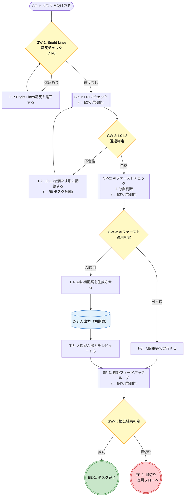
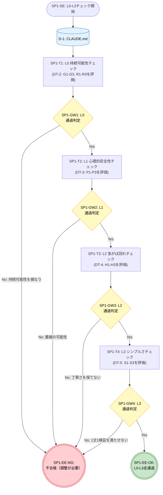
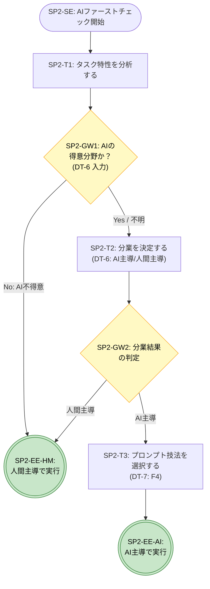
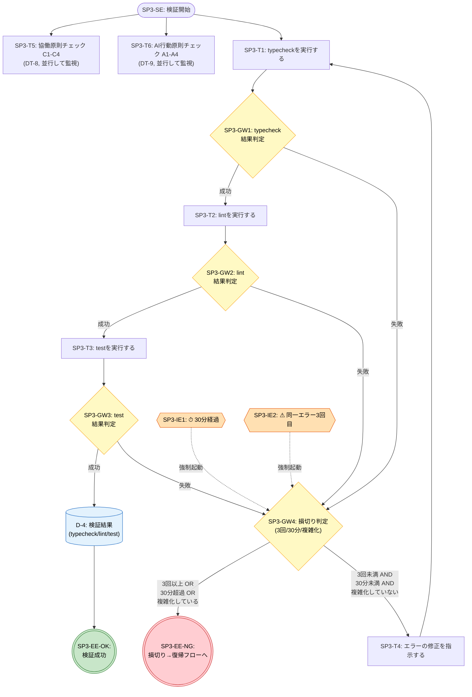
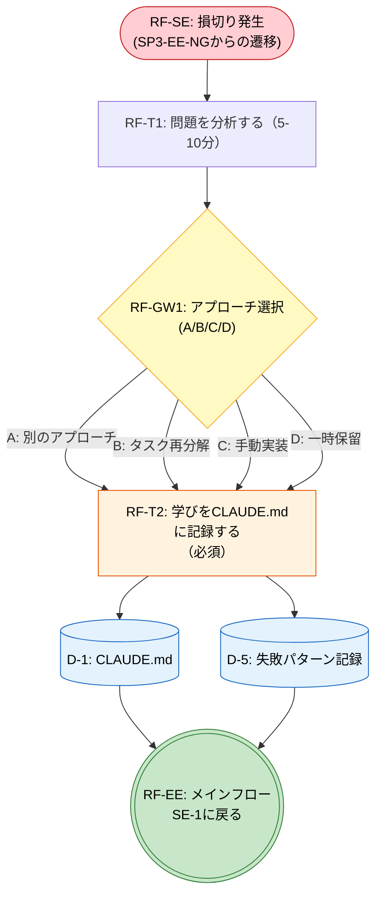
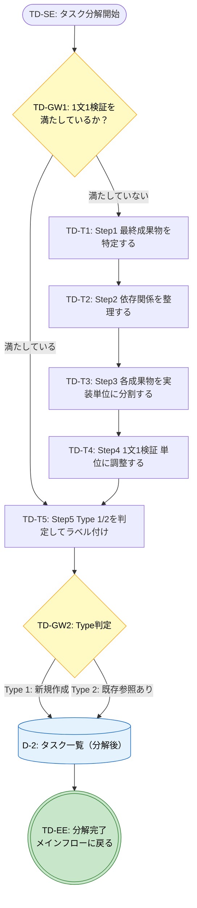
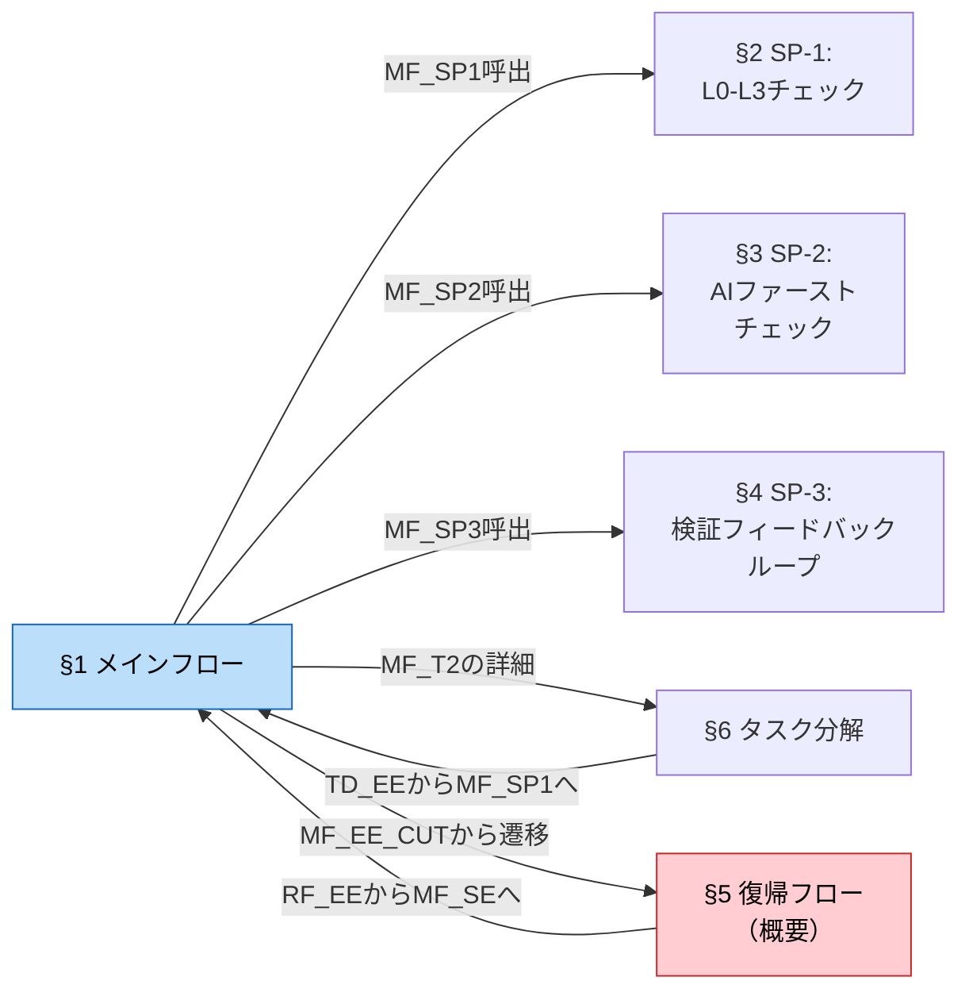

# T4: BPMN要素のMermaid Flowchart化

> **タスク**: T3で分解したBPMN要素（メインフロー＋SP-1〜SP-3＋復帰フロー＋タスク分解）をMermaid flowchart記法で図化する
> **検証方法**: T3の全要素ID（68要素）がMermaid図に含まれていること
> **自信度**: 確実（T3の構造的変換）
> **入力**: `phase1-t3-bpmn-elements.md`
> **方針**: シンプルなflowchartのみ（スイムレーン・エラー境界・メッセージフローは採用しない）
> **Phase 1.5 T2 適用済み**: `phase1.5-mermaid-style-guide.md` の統一ルールを全6図に適用

---

## Mermaid記法とBPMN要素の対応（統一版）

> Phase 1.5 T1 で策定した統一ルール（`phase1.5-mermaid-style-guide.md`）に準拠

| BPMN要素 | 記号 | Mermaid形状 | 記法 | 配色 |
|----------|------|------------|------|------|
| 開始イベント | ○ | スタジアム型 | `ID(["テキスト"])` | なし（デフォルト） |
| 終了イベント（正常） | ◎ | 三重括弧 | `ID((("テキスト")))` | 緑 `fill:#c8e6c9` |
| 終了イベント（異常） | ◎ | 三重括弧 | `ID((("テキスト")))` | 赤 `fill:#ffcdd2` |
| タスク | □ | 矩形 | `ID["テキスト"]` | なし（デフォルト） |
| タスク（必須/重要） | □ | 矩形 | `ID["テキスト"]` | オレンジ `fill:#fff3e0` |
| サブプロセス | □⊞ | サブルーチン型 | `ID[["テキスト"]]` | なし（デフォルト） |
| 排他ゲートウェイ | ◇ | 菱形 | `ID{"テキスト"}` | 黄 `fill:#fff9c4` |
| 中間イベント | ○⏱/○! | 六角形 | `ID{{"テキスト"}}` | オレンジ薄 `fill:#ffe0b2` |
| データオブジェクト | 📄 | シリンダー型（図内配置） | `ID[("テキスト")]` | 青 `fill:#e3f2fd` |

---

## 1. メインフロー: AIファースト実践フロー

> **対応するBPMN要素**: SE-1, GW-1〜GW-4, T-1〜T-5, SP-1〜SP-3, EE-1, EE-2（15要素）
> **対応する決定表**: DT-0（GW-1）、DT-1（SP-1全体+GW-3）

---

## 2. サブプロセス SP-1: L0-L3チェック

> **対応するBPMN要素**: SP1-SE, SP1-T1〜T4, SP1-GW1〜GW4, SP1-EE-OK, SP1-EE-NG（11要素）
> **対応する決定表**: DT-1（メインフロー）、DT-2〜DT-5（各レベル詳細）、DT-10（競合時）

---

## 3. サブプロセス SP-2: AIファーストチェック＋分業判断

> **対応するBPMN要素**: SP2-SE, SP2-T1〜T3, SP2-GW1〜GW2, SP2-EE-AI, SP2-EE-HM（8要素）
> **対応する決定表**: DT-6（分業判断）、DT-7（プロンプト技法選択）

---

## 4. サブプロセス SP-3: 検証フィードバックループ

> **対応するBPMN要素**: SP3-SE, SP3-T1〜T6, SP3-GW1〜GW4, SP3-IE1, SP3-IE2, SP3-EE-OK, SP3-EE-NG（14要素）
> **対応する決定表**: DT-8（協働原則）、DT-9（AI行動原則）

---

## 5. 復帰フロー（概要）

> **対応するBPMN要素**: RF-SE, RF-T1, RF-GW1, RF-T2, RF-EE（5要素）
> **備考**: T5で正式にBPMN要素に分解予定。ここではT3との接続点として概要のみ図化。

---

## 6. タスク分解サブプロセス（T-2の詳細）

> **対応するBPMN要素**: TD-SE, TD-GW1〜GW2, TD-T1〜T5, TD-EE（9要素）
> **出典**: `01c-task-decomposition.md`（タスク分解の5ステップ、Type分類）

---

## 7. データオブジェクト参照表

フロー図内に `[("名称")]` 形式で配置済み。メタ情報として参照関係を表で管理する。

| データID | Mermaid ID | 名称 | 図内配置 | 生成元（図中の要素） | 参照先（図中の要素） |
|---------|-----------|------|---------|---------------------|---------------------|
| D-1 | `D1` | CLAUDE.md | §2, §5 | RF_T2（学び記録時に更新） | SP1_T1〜T4, SP3_T6 |
| D-2 | `D2` | タスク一覧（分解後） | §6 | TD_T5 | MF_SE（再入力） |
| D-3 | `D3` | AI出力（初期案） | §1 | MF_T4 | MF_T5（レビュー対象） |
| D-4 | `D4` | 検証結果（typecheck/lint/test） | §4 | SP3_T1〜T3 | SP3_GW1〜GW3 |
| D-5 | `D5` | 失敗パターン記録 | §5 | RF_T2 | D1（CLAUDE.mdに追記） |

---

## 8. フロー間の接続関係

---

## 検証: T3全要素IDの網羅性チェック

### 開始イベント（6個）

| 要素ID | Mermaid ID | 所在図 | 含まれているか |
|--------|-----------|--------|---------------|
| SE-1 | `MF_SE` | §1 メインフロー | ✅ |
| SP1-SE | `SP1_SE` | §2 SP-1 | ✅ |
| SP2-SE | `SP2_SE` | §3 SP-2 | ✅ |
| SP3-SE | `SP3_SE` | §4 SP-3 | ✅ |
| RF-SE | `RF_SE` | §5 復帰フロー | ✅ |
| TD-SE | `TD_SE` | §6 タスク分解 | ✅ |

### 終了イベント（10個）

| 要素ID | Mermaid ID | 所在図 | 含まれているか |
|--------|-----------|--------|---------------|
| EE-1 | `MF_EE_OK` | §1 メインフロー | ✅ |
| EE-2 | `MF_EE_CUT` | §1 メインフロー | ✅ |
| SP1-EE-OK | `SP1_EE_OK` | §2 SP-1 | ✅ |
| SP1-EE-NG | `SP1_EE_NG` | §2 SP-1 | ✅ |
| SP2-EE-AI | `SP2_EE_AI` | §3 SP-2 | ✅ |
| SP2-EE-HM | `SP2_EE_HM` | §3 SP-2 | ✅ |
| SP3-EE-OK | `SP3_EE_OK` | §4 SP-3 | ✅ |
| SP3-EE-NG | `SP3_EE_NG` | §4 SP-3 | ✅ |
| RF-EE | `RF_EE` | §5 復帰フロー | ✅ |
| TD-EE | `TD_EE` | §6 タスク分解 | ✅ |

### タスク（25個）

| 要素ID | Mermaid ID | 所在図 | 含まれているか |
|--------|-----------|--------|---------------|
| T-1 | `MF_T1` | §1 メインフロー | ✅ |
| T-2 | `MF_T2` | §1 メインフロー | ✅ |
| T-3 | `MF_T3` | §1 メインフロー | ✅ |
| T-4 | `MF_T4` | §1 メインフロー | ✅ |
| T-5 | `MF_T5` | §1 メインフロー | ✅ |
| SP1-T1 | `SP1_T1` | §2 SP-1 | ✅ |
| SP1-T2 | `SP1_T2` | §2 SP-1 | ✅ |
| SP1-T3 | `SP1_T3` | §2 SP-1 | ✅ |
| SP1-T4 | `SP1_T4` | §2 SP-1 | ✅ |
| SP2-T1 | `SP2_T1` | §3 SP-2 | ✅ |
| SP2-T2 | `SP2_T2` | §3 SP-2 | ✅ |
| SP2-T3 | `SP2_T3` | §3 SP-2 | ✅ |
| SP3-T1 | `SP3_T1` | §4 SP-3 | ✅ |
| SP3-T2 | `SP3_T2` | §4 SP-3 | ✅ |
| SP3-T3 | `SP3_T3` | §4 SP-3 | ✅ |
| SP3-T4 | `SP3_T4` | §4 SP-3 | ✅ |
| SP3-T5 | `SP3_T5` | §4 SP-3 | ✅ |
| SP3-T6 | `SP3_T6` | §4 SP-3 | ✅ |
| RF-T1 | `RF_T1` | §5 復帰フロー | ✅ |
| RF-T2 | `RF_T2` | §5 復帰フロー | ✅ |
| TD-T1 | `TD_T1` | §6 タスク分解 | ✅ |
| TD-T2 | `TD_T2` | §6 タスク分解 | ✅ |
| TD-T3 | `TD_T3` | §6 タスク分解 | ✅ |
| TD-T4 | `TD_T4` | §6 タスク分解 | ✅ |
| TD-T5 | `TD_T5` | §6 タスク分解 | ✅ |

### サブプロセス（3個）

| 要素ID | Mermaid ID | 所在図 | 含まれているか |
|--------|-----------|--------|---------------|
| SP-1 | `MF_SP1` | §1 メインフロー | ✅ |
| SP-2 | `MF_SP2` | §1 メインフロー | ✅ |
| SP-3 | `MF_SP3` | §1 メインフロー | ✅ |

### 排他ゲートウェイ（17個）

| 要素ID | Mermaid ID | 所在図 | 含まれているか |
|--------|-----------|--------|---------------|
| GW-1 | `MF_GW1` | §1 メインフロー | ✅ |
| GW-2 | `MF_GW2` | §1 メインフロー | ✅ |
| GW-3 | `MF_GW3` | §1 メインフロー | ✅ |
| GW-4 | `MF_GW4` | §1 メインフロー | ✅ |
| SP1-GW1 | `SP1_GW1` | §2 SP-1 | ✅ |
| SP1-GW2 | `SP1_GW2` | §2 SP-1 | ✅ |
| SP1-GW3 | `SP1_GW3` | §2 SP-1 | ✅ |
| SP1-GW4 | `SP1_GW4` | §2 SP-1 | ✅ |
| SP2-GW1 | `SP2_GW1` | §3 SP-2 | ✅ |
| SP2-GW2 | `SP2_GW2` | §3 SP-2 | ✅ |
| SP3-GW1 | `SP3_GW1` | §4 SP-3 | ✅ |
| SP3-GW2 | `SP3_GW2` | §4 SP-3 | ✅ |
| SP3-GW3 | `SP3_GW3` | §4 SP-3 | ✅ |
| SP3-GW4 | `SP3_GW4` | §4 SP-3 | ✅ |
| RF-GW1 | `RF_GW1` | §5 復帰フロー | ✅ |
| TD-GW1 | `TD_GW1` | §6 タスク分解 | ✅ |
| TD-GW2 | `TD_GW2` | §6 タスク分解 | ✅ |

### 中間イベント（2個）

| 要素ID | Mermaid ID | 所在図 | 含まれているか |
|--------|-----------|--------|---------------|
| SP3-IE1 | `SP3_IE1` | §4 SP-3 | ✅ |
| SP3-IE2 | `SP3_IE2` | §4 SP-3 | ✅ |

### データオブジェクト（5個）

| 要素ID | Mermaid ID | 図内配置 | 含まれているか |
|--------|-----------|---------|---------------|
| D-1 | `D1` | §2 SP-1, §5 復帰フロー | ✅ |
| D-2 | `D2` | §6 タスク分解 | ✅ |
| D-3 | `D3` | §1 メインフロー | ✅ |
| D-4 | `D4` | §4 SP-3 | ✅ |
| D-5 | `D5` | §5 復帰フロー | ✅ |

### 集計

| BPMN要素種別 | T3の個数 | T4での個数 | 一致 |
|-------------|---------|-----------|------|
| 開始イベント | 6 | 6 | ✅ |
| 終了イベント | 10 | 10 | ✅ |
| タスク | 25 | 25 | ✅ |
| サブプロセス | 3 | 3 | ✅ |
| 排他ゲートウェイ | 17 | 17 | ✅ |
| 中間イベント | 2 | 2 | ✅ |
| データオブジェクト | 5 | 5 | ✅ |
| **合計** | **68** | **68** | **✅** |

---

## 検証チェックリスト

- [x] メインフロー（§1）の全要素ID（15個）がMermaid図に含まれている
- [x] SP-1（§2）の全要素ID（11個）がMermaid図に含まれている
- [x] SP-2（§3）の全要素ID（8個）がMermaid図に含まれている
- [x] SP-3（§4）の全要素ID（14個）がMermaid図に含まれている
- [x] 復帰フロー（§5）の全要素ID（5個）がMermaid図に含まれている
- [x] タスク分解（§6）の全要素ID（9個）がMermaid図に含まれている
- [x] データオブジェクト（§7）の全要素ID（5個）が参照表に含まれている
- [x] フロー間の接続関係（§8）が示されている
- [x] T3のBPMN要素統計（68要素）と完全一致している
- [x] 各Mermaid図に対応する決定表（DT-0〜DT-10）の参照が記載されている
- [x] Mermaid記法とBPMN要素の対応表が冒頭に記載されている
- [x] **Phase 1.5 統一ルール準拠**: 開始イベントがスタジアム型 `(["..."])` で統一されている
- [x] **Phase 1.5 統一ルール準拠**: 終了イベントが三重括弧 `((("...")))` で統一されている
- [x] **Phase 1.5 統一ルール準拠**: 全図にstyle指定（配色ルール）が適用されている
- [x] **Phase 1.5 統一ルール準拠**: メインフローIDがプレフィックスベース `MF_*` に統一されている
- [x] **Phase 1.5 統一ルール準拠**: データオブジェクトが `[("...")]` で図内に配置されている
- [x] **Phase 1.5 統一ルール準拠**: 中間イベントが六角形 `{{...}}` で統一されている
- [x] **Phase 1.5 統一ルール準拠**: 矢印ラベルが `-->\|"..."\|` で統一されている
- [x] **Phase 1.5 統一ルール準拠**: 全図にセクションコメント `%% =====` が追加されている
- [x] **Phase 1.5 統一ルール準拠**: ノード内改行が `\n` で統一されている

---

## 出典

- `phase1-t3-bpmn-elements.md` — BPMN要素分解（T4の直接入力）
- `phase1-t2-dmn-decision-tables.md` — 決定表との対応参照
- `phase1-t1-decision-conditions.md` — 判断条件の原典

---

## スコープ外の提案（参考情報）

以下はT4のスコープ外だが、今後の検討事項として記録：

1. **Mermaid図のレンダリング検証**: 各図をMermaidプレビューツールで実際にレンダリングし、表示崩れがないか確認する（→ Phase 1.5 T4で実施予定）
2. **フロー間リンクの統合図**: §8の接続関係図をより詳細にし、全6図を1枚の俯瞰図に統合する
3. **スイムレーン版の作成**: 本タスクで見送った「人間/AI/ツール」のスイムレーンを追加したバージョンを別途作成する
