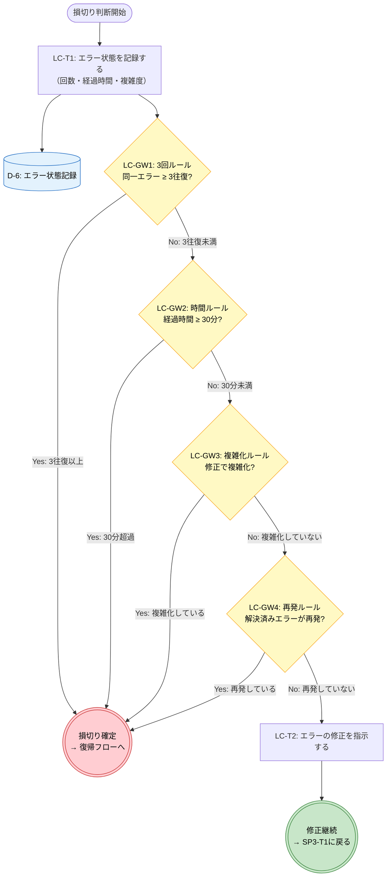
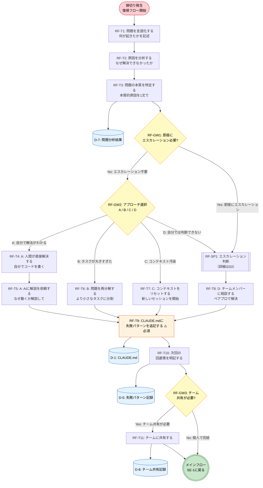
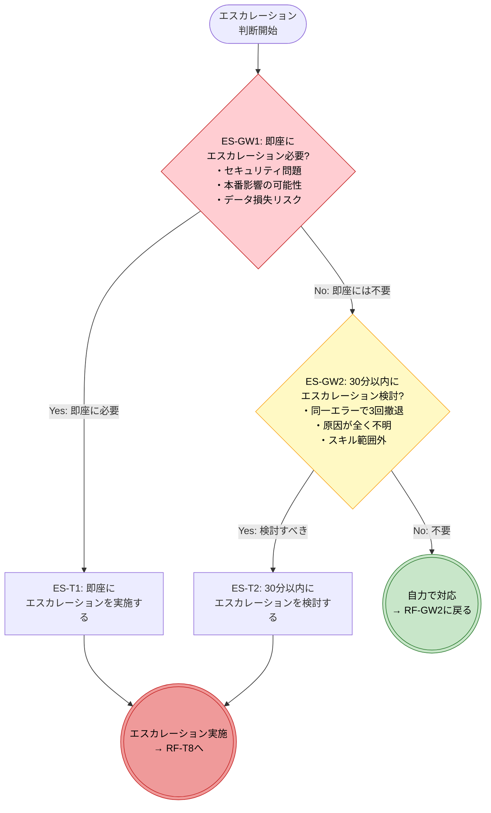
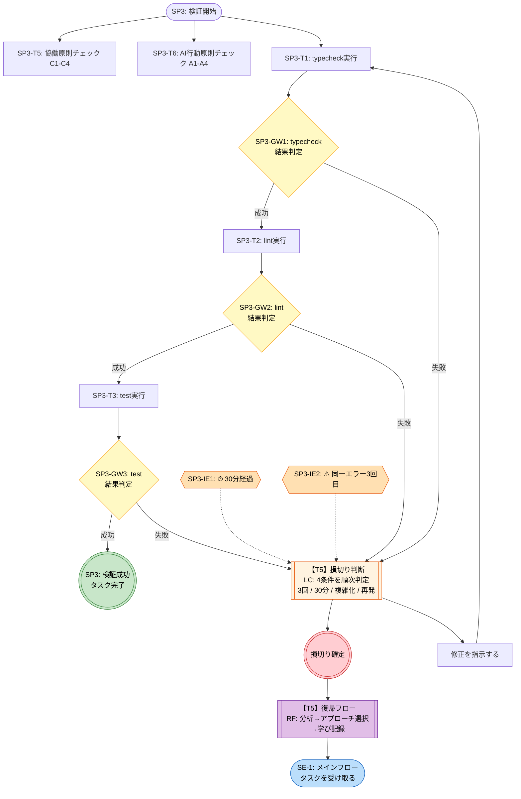

# T6: 損切りルール＋復帰フローの Mermaid flowchart

> **タスク**: T5で分解したBPMN要素（損切り判断・復帰フロー・エスカレーション判断）をMermaid flowchart記法で図化する
> **検証方法**: T5の全要素ID（LC-*, RF-*, ES-*）がMermaid図に含まれていること
> **自信度**: 確実（T5のBPMN要素からの構造的変換）
> **入力**: `phase1-t5-losscutrecovery-bpmn.md`
> **Phase 1.5 T3 適用済み**: `phase1.5-mermaid-style-guide.md` の統一ルールを全4図に適用

---

## Mermaid記法の凡例（統一版）

> Phase 1.5 T1 で策定した統一ルール（`phase1.5-mermaid-style-guide.md`）に準拠

| BPMN要素 | 記号 | Mermaid形状 | 記法 | 配色 |
|----------|------|------------|------|------|
| 開始イベント | ○ | スタジアム型 | `ID(["名称"])` | なし（デフォルト） |
| 終了イベント（正常） | ◎ | 三重括弧 | `ID((("名称")))` | 緑 `fill:#c8e6c9` |
| 終了イベント（異常） | ◎ | 三重括弧 | `ID((("名称")))` | 赤 `fill:#ffcdd2` |
| タスク | □ | 矩形 | `ID["名称"]` | なし（デフォルト） |
| タスク（必須/重要） | □ | 矩形 | `ID["名称"]` | オレンジ `fill:#fff3e0` |
| サブプロセス | □⊞ | サブルーチン型 | `ID[["名称"]]` | なし（デフォルト） |
| 排他ゲートウェイ | ◇ | 菱形 | `ID{"名称"}` | 黄 `fill:#fff9c4` |
| 中間イベント | ○⏱/○! | 六角形 | `ID{{"名称"}}` | オレンジ薄 `fill:#ffe0b2` |
| データオブジェクト | 📄 | シリンダー型 | `ID[("名称")]` | 青 `fill:#e3f2fd` |

**IDの命名規則**: T5の要素ID（LC-SE, RF-T1等）をMermaid互換のID（LC_SE, RF_T1等）に変換（ハイフンをアンダースコアに置換）。対応表は§5に記載。

---

## 1. 損切り判断サブプロセス（LC）

> **T5 §1に対応**
> SP-3（検証フィードバックループ）内で検証失敗時に起動される

---

## 2. 損切り後の復帰フロー（RF）

> **T5 §2に対応**
> LC-EE-CUT（損切り確定）から遷移

---

## 3. エスカレーション判断サブプロセス（ES）

> **T5 §3に対応**
> RF-GW1またはRF-GW2のDパスから起動

---

## 4. 統合フロー: T3 SP-3 + T5 接続図

> T3の検証フィードバックループ（SP-3）とT5の損切り判断・復帰フローがどのように接続するかを示す概観図

---

## 5. 要素ID対応表（T5 → Mermaid）

### 5.1 損切り判断サブプロセス（LC）

| T5の要素ID | Mermaid ID | Mermaid図 | 確認 |
|-----------|-----------|----------|------|
| LC-SE | LC_SE | §1 | ✅ |
| LC-T1 | LC_T1 | §1 | ✅ |
| LC-GW1 | LC_GW1 | §1 | ✅ |
| LC-GW2 | LC_GW2 | §1 | ✅ |
| LC-GW3 | LC_GW3 | §1 | ✅ |
| LC-GW4 | LC_GW4 | §1 | ✅ |
| LC-T2 | LC_T2 | §1 | ✅ |
| LC-EE-CONT | LC_EE_CONT | §1 | ✅ |
| LC-EE-CUT | LC_EE_CUT | §1 | ✅ |

### 5.2 復帰フロー（RF）

| T5の要素ID | Mermaid ID | Mermaid図 | 確認 |
|-----------|-----------|----------|------|
| RF-SE | RF_SE | §2 | ✅ |
| RF-T1 | RF_T1 | §2 | ✅ |
| RF-T2 | RF_T2 | §2 | ✅ |
| RF-T3 | RF_T3 | §2 | ✅ |
| RF-GW1 | RF_GW1 | §2 | ✅ |
| RF-SP1 | RF_SP1 | §2 | ✅ |
| RF-GW2 | RF_GW2 | §2 | ✅ |
| RF-T4 | RF_T4 | §2 | ✅ |
| RF-T5 | RF_T5 | §2 | ✅ |
| RF-T6 | RF_T6 | §2 | ✅ |
| RF-T7 | RF_T7 | §2 | ✅ |
| RF-T8 | RF_T8 | §2 | ✅ |
| RF-T9 | RF_T9 | §2 | ✅ |
| RF-T10 | RF_T10 | §2 | ✅ |
| RF-GW3 | RF_GW3 | §2 | ✅ |
| RF-T11 | RF_T11 | §2 | ✅ |
| RF-EE | RF_EE | §2 | ✅ |

### 5.3 エスカレーション判断サブプロセス（ES）

| T5の要素ID | Mermaid ID | Mermaid図 | 確認 |
|-----------|-----------|----------|------|
| ES-SE | ES_SE | §3 | ✅ |
| ES-GW1 | ES_GW1 | §3 | ✅ |
| ES-GW2 | ES_GW2 | §3 | ✅ |
| ES-T1 | ES_T1 | §3 | ✅ |
| ES-T2 | ES_T2 | §3 | ✅ |
| ES-EE-ESC | ES_EE_ESC | §3 | ✅ |
| ES-EE-SELF | ES_EE_SELF | §3 | ✅ |

### 5.4 データオブジェクト

| T5の要素ID | Mermaid図での出現 | 確認 |
|-----------|-----------------|------|
| D-1 (CLAUDE.md) | §2 (D1) | ✅ |
| D-5 (失敗パターン記録) | §2 (D5) | ✅ |
| D-6 (エラー状態記録) | §1 (D6) | ✅ |
| D-7 (問題分析結果) | §2 (D7) | ✅ |
| D-8 (チーム共有記録) | §2 (D8) | ✅ |

### 5.5 T3要素（§4 統合フロー図に含まれるもの）

| T3の要素ID | Mermaid ID | 確認 |
|-----------|-----------|------|
| SP3-SE | SP3_SE | ✅ |
| SP3-T1 | SP3_T1 | ✅ |
| SP3-T2 | SP3_T2 | ✅ |
| SP3-T3 | SP3_T3 | ✅ |
| SP3-T5 | SP3_T5 | ✅ |
| SP3-T6 | SP3_T6 | ✅ |
| SP3-GW1 | SP3_GW1 | ✅ |
| SP3-GW2 | SP3_GW2 | ✅ |
| SP3-GW3 | SP3_GW3 | ✅ |
| SP3-IE1 | SP3_IE1 | ✅ |
| SP3-IE2 | SP3_IE2 | ✅ |
| SP3-EE-OK | SP3_EE_OK | ✅ |

---

## 検証チェックリスト

- [x] T5 §1 の全要素（LC-SE〜LC-EE-CUT: 9要素）がMermaid図§1に含まれている
- [x] T5 §2 の全要素（RF-SE〜RF-EE: 16要素 + RF-SP1: 1サブプロセス）がMermaid図§2に含まれている
- [x] T5 §3 の全要素（ES-SE〜ES-EE-SELF: 7要素）がMermaid図§3に含まれている
- [x] T5 §4 のデータオブジェクト（D-1, D-5, D-6, D-7, D-8）がMermaid図に含まれている
- [x] T3 SP-3との接続関係が統合フロー図§4で示されている
- [x] 損切り4条件（3回/30分/複雑化/再発）の分岐ラベルが明示されている
- [x] 復帰フロー4パターン（A/B/C/D）の分岐ラベルが明示されている
- [x] エスカレーション3段階（即座/30分以内/不要）の分岐が表現されている
- [x] 各図の色分けが意味的に整合している（赤:損切り/停止、緑:成功/継続、黄:判定、青:データ）
- [x] 全要素のID対応表（T5 ID → Mermaid ID）が§5に記載されている
- [x] **Phase 1.5 統一ルール準拠**: 開始イベントがスタジアム型 `(["..."])` で統一されている
- [x] **Phase 1.5 統一ルール準拠**: 終了イベントが三重括弧 `((("...")))` で統一されている
- [x] **Phase 1.5 統一ルール準拠**: 全図にstyle指定（配色ルール）が適用されている
- [x] **Phase 1.5 統一ルール準拠**: IDがプレフィックスベースで統一されている
- [x] **Phase 1.5 統一ルール準拠**: データオブジェクトが `[("...")]` で図内に配置されている
- [x] **Phase 1.5 統一ルール準拠**: 中間イベントが六角形 `{{...}}` で統一されている
- [x] **Phase 1.5 統一ルール準拠**: 矢印ラベルが `-->|"..."|` で統一されている
- [x] **Phase 1.5 統一ルール準拠**: 全図にセクションコメント `%% =====` が含まれている
- [x] **Phase 1.5 統一ルール準拠**: ノード内改行が `\n` で統一されている

---

## 出典

- `phase1-t5-losscutrecovery-bpmn.md` — T5成果物（全BPMN要素定義、フロー接続関係）
- `phase1-t3-bpmn-elements.md` — T3成果物（SP-3検証フィードバックループ、統合フロー図の接続元）

---

## スコープ外の提案（参考情報）

以下はT6のスコープ外だが、今後の検討事項として記録：

1. **スイムレーンの導入**: 復帰フロー（RF）において「人間」「AI」「チーム」の3レーンに分けると、各アプローチ（A〜D）の実行主体がより明確になる。ただしMermaid flowchartではスイムレーンのサポートが限定的なため、別途BPMN描画ツール（bpmn.io等）への移行が前提となる
2. **インタラクティブ化**: 各サブプロセスノードにリンクを付与し、クリックで詳細フローに遷移できる構成（Mermaidの`click`ディレクティブを活用）
3. **復帰フロー実践例のアノテーション**: T5出典の実践例（型エラー3往復→B:再分解→CLAUDE.md追記）を、Mermaid図上のノートとして付加し、具体的なユースケースを可視化
4. ~~**カラーテーマの統一**: T4とT6の配色・ノード形状の統一ガイドラインを策定~~ → **Phase 1.5 T1〜T3で対応済み**
